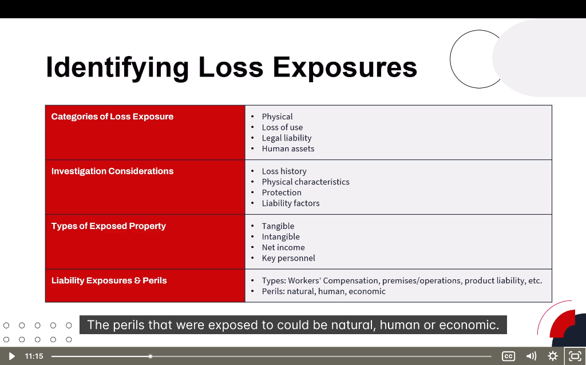

# 🎯 Identifying Loss Exposures

> **Module:** Introduction | **Source:** PNC Learning - Demo RIBO 1 Sample Lecture

---

## 📸 Lecture Screenshot

---

## 📚 What is a Loss Exposure?

A **loss exposure** is any situation or condition that presents the **possibility of a financial loss**. As an insurance broker, your job is to identify these exposures and help clients protect against them.

> 💡 **Think of it this way:** A loss exposure is anything that could go wrong and cost your client money.

---

## 🗂️ Topics in This Section

| # | Topic | File |
|---|-------|------|
| 1 | Categories of Loss Exposure | [01-categories-of-loss-exposure.md](./01-categories-of-loss-exposure.md) |
| 2 | Investigation Considerations | [02-investigation-considerations.md](./02-investigation-considerations.md) |
| 3 | Types of Exposed Property | [03-types-of-exposed-property.md](./03-types-of-exposed-property.md) |
| 4 | Liability Exposures & Perils | [04-liability-exposures-and-perils.md](./04-liability-exposures-and-perils.md) |

---

## 🎓 Why This Matters for RIBO

On the RIBO Level 1 exam, you'll need to:
- ✅ Identify different types of loss exposures
- ✅ Categorize risks correctly (property vs. liability)
- ✅ Recommend appropriate coverage based on exposures
- ✅ Understand what factors increase risk

> ⚠️ **Exam Tip:** Questions often present scenarios where you must identify the TYPE of loss exposure before recommending coverage.

---

*Continue to the individual topic files for detailed explanations and examples →*
