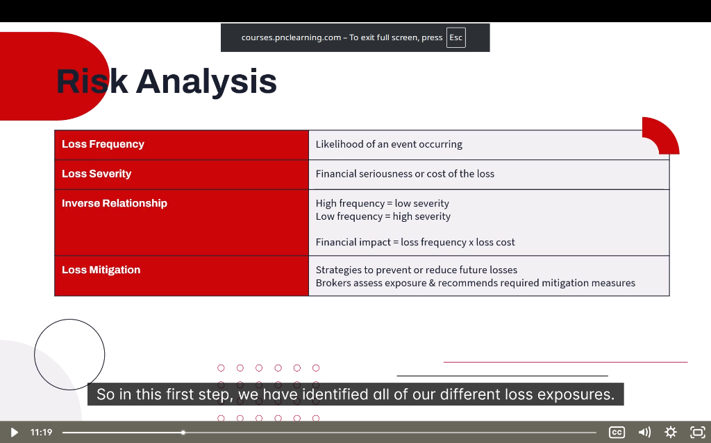

# 📊 Risk Analysis

> **Module:** Introduction | **Source:** PNC Learning - Demo RIBO 1 Sample Lecture

---

## 📸 Lecture Screenshot



---

## What is Risk Analysis?

**Risk analysis** is the process of evaluating the likelihood and potential impact of losses. It helps brokers and insurers:
- Price policies appropriately
- Determine what coverage is needed
- Recommend risk mitigation strategies

> 💡 **As a broker:** After you identify loss exposures (previous topic), you analyze the RISK of those exposures happening and how bad they'd be.

---

## 🗂️ Key Concepts

| Concept | Definition |
|---------|------------|
| **Loss Frequency** | How often losses are likely to occur |
| **Loss Severity** | How expensive/serious each loss would be |
| **Inverse Relationship** | High frequency usually means low severity (and vice versa) |
| **Loss Mitigation** | Strategies to prevent or reduce losses |

---

## 1️⃣ Loss Frequency

**Definition:** The **likelihood** or probability that a loss will occur. Also called "probability of loss."

### Frequency Categories:

| Category | Description | Example |
|----------|-------------|---------|
| **Almost Nil** | Extremely rare, almost never happens | Meteor strike |
| **Slight** | Possible but unlikely | Major earthquake in Ontario |
| **Moderate** | Happens occasionally | Car fender-bender |
| **Definite** | Almost certain to happen | Normal wear and tear |

### How to Assess Frequency:

| Factor | What to Look At |
|--------|-----------------|
| **Loss history** | How often has this happened before? |
| **Industry data** | What's typical for this type of business? |
| **Location** | High-crime area? Flood zone? |
| **Operations** | Dangerous activities? High foot traffic? |

### Real-Life Example:
> **Two Auto Insurance Clients:**
> 
> | Client A | Client B |
> |----------|----------|
> | 45-year-old, clean record | 19-year-old, 2 speeding tickets |
> | Drives 5,000 km/year | Drives 25,000 km/year |
> | Suburban area | Downtown Toronto |
> 
> **Client B** has higher **loss frequency** — more likely to have an accident.

---

## 2️⃣ Loss Severity

**Definition:** The **financial seriousness** or cost of a loss when it occurs.

### Severity Categories:

| Category | Description | Example |
|----------|-------------|---------|
| **Slight** | Minor cost, easily absorbed | Scratched bumper ($500) |
| **Significant** | Noticeable financial impact | Water damage ($10,000) |
| **Severe** | Major financial strain | House fire ($300,000) |
| **Catastrophic** | Could bankrupt/destroy | Business burns down completely |

### Factors Affecting Severity:

| Factor | How It Affects Severity |
|--------|------------------------|
| **Value of property** | Higher value = higher potential loss |
| **Type of loss** | Total loss vs. partial damage |
| **Business interruption** | Lost income on top of property damage |
| **Liability exposure** | Lawsuits can be extremely expensive |
| **Replacement cost** | Unique items cost more to replace |

### Real-Life Example:
> **Coffee Shop vs. Jewelry Store:**
> 
> Both experience a break-in and theft.
> 
> | Coffee Shop | Jewelry Store |
> |-------------|---------------|
> | Cash register stolen: $500 | Diamonds stolen: $200,000 |
> | Low severity | High severity |
> 
> Same peril (theft), vastly different severity!

---

## 3️⃣ The Inverse Relationship

**Definition:** There's typically an **inverse relationship** between frequency and severity:
- **High frequency** losses tend to be **low severity**
- **Low frequency** losses tend to be **high severity**

### The Formula:

```
Financial Impact = Loss Frequency × Loss Cost (Severity)
```

### Visual Representation:

| | Low Severity | High Severity |
|--|-------------|---------------|
| **High Frequency** | ✅ Common (minor fender-benders) | ⚠️ Problematic (avoid this!) |
| **Low Frequency** | ✅ Ideal (rare and minor) | ⚠️ Catastrophic (rare but devastating) |

### Examples:

| Event | Frequency | Severity | Risk Level |
|-------|-----------|----------|------------|
| Minor car scratches | High | Low | Manageable |
| Major car accident | Low | High | Insure against this! |
| Office paper jam | High | Low | Don't need insurance |
| Office building fire | Low | High | MUST have insurance |

### Real-Life Example:
> **Home Insurance Perspective:**
> 
> | Loss Type | Frequency | Severity |
> |-----------|-----------|----------|
> | Window breaks | Common (kids, storms) | Low ($200-$500) |
> | House burns down | Very rare | Catastrophic ($400,000+) |
> 
> **Insurance Insight:** Homeowners often pay small window repairs themselves (deductible), but rely on insurance for the rare, severe losses.

### Why This Matters for Brokers:

> 💡 **Risk Priority Matrix:**
> 
> 1. **Insure** against low-frequency, high-severity risks (catastrophic)
> 2. **Prevent/Reduce** high-frequency, high-severity risks (danger zone)
> 3. **Retain** (self-insure) high-frequency, low-severity risks (use deductibles)
> 4. **Accept** low-frequency, low-severity risks (not worth insuring)

---

## 4️⃣ Loss Mitigation

**Definition:** Strategies to **prevent or reduce** future losses. Brokers assess exposures and recommend appropriate mitigation measures.

### Two Types of Mitigation:

| Type | Goal | Examples |
|------|------|----------|
| **Loss Prevention** | Stop the loss from happening | Locks, alarms, training, fire-resistant materials |
| **Loss Reduction** | Minimize damage when loss occurs | Sprinklers, fire extinguishers, backup systems |

### Loss Mitigation Strategies:

| Strategy | What It Does | Example |
|----------|--------------|---------|
| **Avoidance** | Eliminate the risk entirely | Don't sell alcohol → no liquor liability |
| **Prevention** | Reduce likelihood of loss | Install security cameras → fewer thefts |
| **Reduction** | Minimize severity if loss occurs | Install sprinklers → less fire damage |
| **Transfer** | Shift risk to someone else | Buy insurance; hire a contractor |
| **Retention** | Accept and pay for losses yourself | Higher deductibles; self-insurance |

### The Broker's Role:

As a broker, you:
1. **Assess** the client's loss exposures
2. **Analyze** frequency and severity
3. **Recommend** appropriate mitigation measures
4. **Arrange** insurance for remaining risks

### Real-Life Example:
> **Restaurant Risk Assessment:**
> 
> | Risk | Mitigation Recommended |
> |------|------------------------|
> | Kitchen fires | Fire suppression system (reduction) |
> | Slip and falls | Non-slip mats, "wet floor" signs (prevention) |
> | Food poisoning | Staff training, temp monitoring (prevention) |
> | Robbery | Safe, security cameras, limited cash (prevention + reduction) |
> | Catastrophic fire | Property insurance (transfer) |

### Impact on Premiums:

| Mitigation Action | Effect on Premium |
|-------------------|------------------|
| ✅ Install alarm system | Lower premium |
| ✅ Sprinkler system | Lower premium |
| ✅ Staff safety training | Lower premium |
| ✅ Good loss history | Lower premium |
| ❌ No safety measures | Higher premium |
| ❌ Poor loss history | Higher premium or declined |

---

## 📝 Quick Summary Table

| Concept | Key Question | Impact on Insurance |
|---------|--------------|---------------------|
| **Loss Frequency** | "How often will this happen?" | More frequent = higher premium |
| **Loss Severity** | "How bad will it be?" | More severe = higher coverage needed |
| **Inverse Relationship** | "Frequency × Severity = ?" | Helps prioritize what to insure |
| **Loss Mitigation** | "How can we prevent/reduce this?" | Good mitigation = lower premiums |

---

## 🧠 Practice Question

> A commercial property has the following risk profile:
> - 5 small water damage claims per year (avg. $2,000 each)
> - 1 major fire claim every 20 years (avg. $500,000)
> 
> **Which loss has the greater annual financial impact?**
> 
> a) Water damage claims  
> b) Fire claims  
> c) They are equal  
> d) Cannot be determined

<details>
<summary>Click to reveal answer</summary>

**Answer: b) Fire claims**

Let's use the formula: **Financial Impact = Frequency × Severity**

**Water Damage:**
- 5 claims/year × $2,000 = **$10,000/year**

**Fire:**
- 1 claim every 20 years = 0.05 claims/year
- 0.05 × $500,000 = **$25,000/year**

Even though fires are rare, the severity is so high that the annual expected loss ($25,000) is greater than the frequent but minor water damage ($10,000).

**This is why we insure for catastrophic, low-frequency events!**

</details>

---

## 🎓 Key RIBO Takeaways

1. **Loss Frequency** = How often | **Loss Severity** = How bad
2. **High frequency + high severity** = DANGER! Must prevent and insure
3. **Low frequency + high severity** = Why insurance exists
4. **Mitigation reduces both frequency AND severity**
5. **Brokers recommend mitigation measures** to help clients manage risk

---

*← Back to: [Identifying Loss Exposures Overview](./00-identifying-loss-exposures.md)*
