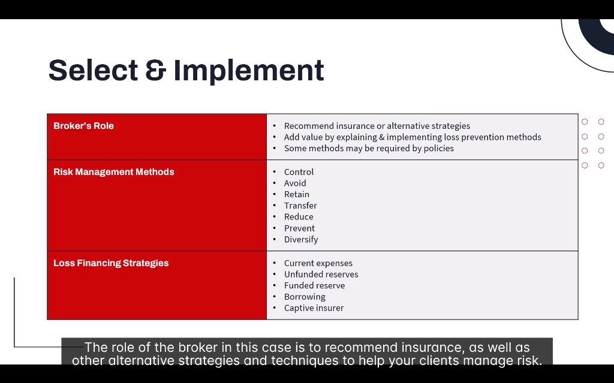
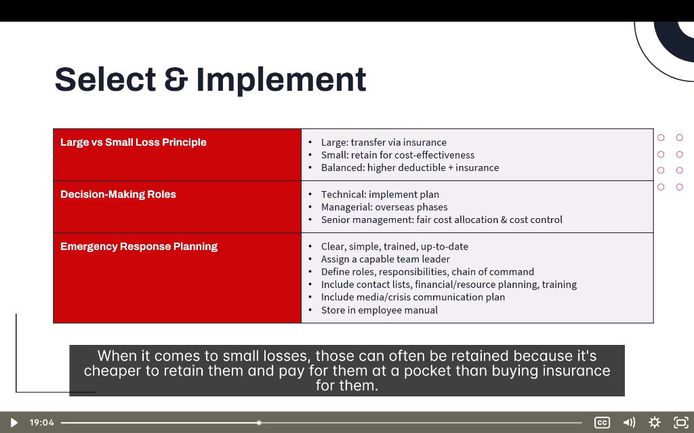

# 🎯 Select & Implement Risk Management

> **Module:** Introduction | **Source:** PNC Learning - Demo RIBO 1 Sample Lecture

---

## 📸 Lecture Screenshot

---

## Overview

After identifying and analyzing risks, the next step is to **select and implement** strategies to manage them. This is where the broker adds real value!

> 💡 **The broker's role:** Recommend insurance OR alternative strategies to help clients manage risk effectively.

---

## 🗂️ Key Concepts

| Concept | Definition |
|---------|------------|
| **Broker's Role** | Recommend solutions and add value through expertise |
| **Risk Management Methods** | Techniques to handle risk (7 methods) |
| **Loss Financing Strategies** | Ways to pay for losses that do occur |

---

## 1️⃣ The Broker's Role

As a broker, you do more than just sell policies. You:

| Responsibility | What It Means |
|----------------|---------------|
| **Recommend insurance** | Match coverage to client's exposures |
| **Suggest alternatives** | Sometimes insurance isn't the only answer |
| **Explain loss prevention** | Help clients understand how to reduce risk |
| **Implement methods** | Assist in putting risk management into action |
| **Ensure compliance** | Some methods may be required by policies |

### Adding Value as a Broker:

> You're not just a salesperson — you're a **risk management consultant**!

| How You Add Value | Example |
|-------------------|---------|
| Identify gaps in coverage | "You have property insurance but no business interruption" |
| Recommend safety measures | "Install sprinklers to lower your premium by 15%" |
| Explain policy requirements | "Your policy requires monthly fire extinguisher inspections" |
| Compare options | "Here are 3 insurers — let me explain the differences" |

### Policy-Required Methods:

Some insurance policies **require** certain risk management measures:

| Requirement | Why |
|-------------|-----|
| Burglar alarm system | Reduces theft claims |
| Fire suppression system | Limits fire damage severity |
| Regular inspections | Catches problems early |
| Minimum security standards | Prevents "moral hazard" |

> ⚠️ **Warning:** If a client doesn't comply with policy requirements, claims can be **denied**!

---

## 2️⃣ Risk Management Methods

There are **7 main methods** to manage risk. Remember this with the memory trick: **"CART-PRD"**

### The 7 Methods:

| Method | Definition | Example |
|--------|------------|---------|
| **C - Control** | Manage the risk with procedures/systems | Safety protocols, supervision |
| **A - Avoid** | Eliminate the risk entirely | Don't offer high-risk services |
| **R - Retain** | Accept and pay for losses yourself | High deductibles, self-insurance |
| **T - Transfer** | Shift risk to someone else | Insurance, contracts, outsourcing |
| **P - Prevent** | Stop losses from happening | Training, locks, maintenance |
| **R - Reduce** | Minimize severity when lost occurs | Sprinklers, backup systems |
| **D - Diversify** | Spread risk across multiple areas | Multiple suppliers, locations |

---

### 📌 Control

**Definition:** Implement systems, procedures, or oversight to manage risk.

| Control Type | Example |
|--------------|---------|
| Administrative | Written safety policies |
| Physical | Guards, barriers, locks |
| Technical | Alarms, monitoring systems |
| Supervisory | Regular inspections, oversight |

**Real-Life Example:**
> A construction company implements:
> - Daily safety briefings
> - Supervisor sign-off on tasks
> - Regular equipment inspections
> 
> These **controls** reduce workplace accidents.

---

### 📌 Avoid

**Definition:** Completely eliminate the exposure by not engaging in the risky activity.

| Scenario | Avoidance Strategy |
|----------|-------------------|
| Product liability concerns | Don't manufacture that product |
| Liquor liability | Don't serve alcohol |
| Swimming pool liability | Fill in the pool |
| High-risk client | Decline to insure them |

**Real-Life Example:**
> A restaurant owner decides NOT to get a liquor license.
> 
> **Result:** They've completely **avoided** liquor liability exposure. No drunk driving lawsuits possible from their establishment.

> ⚠️ **Trade-off:** Avoidance eliminates risk but may also eliminate opportunity/profit.

---

### 📌 Retain

**Definition:** Accept the risk and pay for losses out of pocket.

| Retention Type | Description |
|----------------|-------------|
| **Planned retention** | Deliberately choosing high deductibles |
| **Unplanned retention** | Gaps in coverage you didn't know about |
| **Self-insurance** | Setting aside funds for expected losses |

**When to Retain:**
| Situation | Why Retain |
|-----------|------------|
| Low-frequency, low-severity losses | Not worth paying premiums |
| Cost of insurance > expected losses | Cheaper to pay yourself |
| Large company with cash reserves | Can handle the loss |

**Real-Life Example:**
> A large retail chain chooses a **$25,000 deductible** on property insurance.
> 
> - They retain the first $25,000 of any loss
> - Premium is significantly lower
> - They save this money in a reserve fund

---

### 📌 Transfer

**Definition:** Shift the financial burden of risk to another party.

| Transfer Method | How It Works |
|-----------------|--------------|
| **Insurance** | Pay premiums; insurer pays claims |
| **Contracts** | "Hold harmless" clauses shift liability |
| **Outsourcing** | Hire contractor; their insurance covers them |
| **Hedging** | Financial instruments for market risk |

**Real-Life Example:**
> A property owner hires a snow removal contractor.
> 
> - Contract requires contractor to have liability insurance
> - If someone slips on ice, contractor's insurance pays
> - Risk has been **transferred** to the contractor

> 💡 **Most common transfer method:** Buying insurance!

---

### 📌 Prevent (Loss Prevention)

**Definition:** Take action to stop losses from happening in the first place.

| Prevention Focus | Examples |
|------------------|----------|
| Fire | No smoking policies, proper storage of flammables |
| Theft | Background checks, access controls, lighting |
| Injuries | Training, safety equipment, warning signs |
| Cyber | Firewalls, password policies, staff training |

**Real-Life Example:**
> A jewelry store implements:
> - Locked display cases
> - Security cameras
> - Buzzer entry system
> - Employee background checks
> 
> These measures **prevent** thefts from occurring.

---

### 📌 Reduce (Loss Reduction)

**Definition:** Minimize the severity/damage when a loss does occur.

| Reduction Method | What It Does |
|------------------|--------------|
| Sprinkler systems | Limits fire spread |
| Fire doors | Contains fire to one area |
| Backup generators | Reduces business interruption |
| First aid training | Minimizes injury severity |
| Data backups | Reduces data loss impact |

**Real-Life Example:**
> A warehouse has a fire, but:
> - Sprinklers activate and contain the fire to one section
> - Fire doors prevent spread to inventory
> - Fire extinguishers allow employees to fight small fires
> 
> **Result:** $50,000 damage instead of $500,000 total loss.

> 💡 **Prevention** stops the fire from starting. **Reduction** limits damage once it starts.

---

### 📌 Diversify

**Definition:** Spread risk across multiple sources so one loss doesn't cripple everything.

| Diversification | Example |
|-----------------|---------|
| Multiple suppliers | If one fails, others can deliver |
| Multiple locations | Fire at one doesn't close all |
| Product variety | If one product fails, others succeed |
| Customer base | Not dependent on one big client |

**Real-Life Example:**
> A manufacturer has 3 factories:
> - Toronto
> - Montreal  
> - Vancouver
> 
> If a fire destroys the Toronto plant, they can shift production to the other two. The business survives.

---

## 3️⃣ Loss Financing Strategies

When losses DO happen, how do you pay for them? These are the options:

| Strategy | What It Means |
|----------|---------------|
| **Current Expenses** | Pay from regular cash flow |
| **Unfunded Reserves** | Promise to pay but no money set aside |
| **Funded Reserves** | Actual money saved for losses |
| **Borrowing** | Take out a loan to cover the loss |
| **Captive Insurer** | Create your own insurance company |

---

### 💵 Current Expenses

**Definition:** Pay for losses from regular operating income as they occur.

| Best For | Not Good For |
|----------|--------------|
| Small, predictable losses | Large, unexpected losses |
| Healthy cash flow businesses | Cash-tight businesses |

**Example:**
> A restaurant pays for a broken window ($300) from their regular monthly budget. No special fund needed.

---

### 📋 Unfunded Reserves

**Definition:** A plan to pay for losses, but no actual money set aside.

| Pros | Cons |
|------|------|
| No money tied up | May not have funds when needed |
| Flexible | Risky for larger losses |

**Example:**
> A company has a policy: "We'll cover the first $5,000 of any employee injury."
> 
> But they haven't actually put $5,000 in a separate account. It's just a promise.

> ⚠️ **Risk:** If multiple losses happen, they may not have the funds!

---

### 🏦 Funded Reserves

**Definition:** Actual money set aside specifically for paying future losses.

| Pros | Cons |
|------|------|
| Money is there when needed | Cash is tied up |
| Earns interest while waiting | Opportunity cost |
| Planned, disciplined approach | May over- or under-fund |

**Example:**
> A property management company puts $10,000/month into a "maintenance reserve fund" to cover future repairs.

---

### 💳 Borrowing

**Definition:** Take out a loan or line of credit to pay for losses.

| When It Works | When It Doesn't |
|---------------|-----------------|
| Good credit available | Already heavily in debt |
| Loss is temporary setback | Ongoing cash flow problems |
| Business is otherwise healthy | Poor credit history |

**Example:**
> A business suffers flood damage and uses their $250,000 line of credit to cover repairs while waiting for insurance settlement.

---

### 🏢 Captive Insurer

**Definition:** A subsidiary company created specifically to insure the parent company's risks.

| Best For | How It Works |
|----------|--------------|
| Large corporations | Parent company owns the insurer |
| Unique risks hard to insure | Pay "premiums" to your own subsidiary |
| Companies with good loss history | Keep profits if claims are low |

**Example:**
> A multinational corporation creates "ABC Insurance Ltd." (a captive) to insure its fleet of 5,000 vehicles worldwide. Instead of paying premiums to external insurers, profits stay in the family.

> 💡 **Note:** Captives are for LARGE organizations. Most RIBO clients won't use this.

---

## 📝 Summary Table

| Category | Methods |
|----------|---------|
| **Risk Management** | Control, Avoid, Retain, Transfer, Prevent, Reduce, Diversify |
| **Loss Financing** | Current Expenses, Unfunded Reserves, Funded Reserves, Borrowing, Captive |

---

## 🧠 Practice Question

> A restaurant owner is concerned about liability from customers slipping on wet floors. Which combination of risk management methods would be MOST effective?
> 
> a) Avoid and Retain  
> b) Prevent and Transfer  
> c) Diversify and Reduce  
> d) Control and Avoid

Click to reveal answer

**Answer: b) Prevent and Transfer**

- **Prevent:** Use non-slip mats, "wet floor" signs, clean up spills immediately
- **Transfer:** Buy liability insurance to cover any lawsuits that do occur

This is the ideal combination:
1. Take steps to PREVENT the loss from happening
2. TRANSFER the risk through insurance for losses you can't prevent

**Why not the others:**
- a) You can't "avoid" having floors! And retaining liability risk is dangerous.
- c) Diversifying doesn't apply here; reducing is good but you need the transfer too.
- d) Avoiding isn't possible for a restaurant.

---

## 🎓 Key RIBO Takeaways

1. **Brokers recommend BOTH insurance AND alternative strategies**
2. **7 Risk Management Methods:** Control, Avoid, Retain, Transfer, Prevent, Reduce, Diversify
3. **Transfer = Insurance** is the most common method
4. **Loss Financing** = How you pay when losses happen
5. **Captive insurers** are only for large corporations

---

## 📸 Part 2: Additional Implementation Concepts

---

## 4️⃣ Large vs Small Loss Principle

One of the most important decision-making frameworks in risk management!

### The Principle:

| Loss Size | Strategy | Reasoning |
|-----------|----------|-----------|
| **Large Losses** | Transfer via insurance | Too expensive to absorb yourself |
| **Small Losses** | Retain for cost-effectiveness | Cheaper to pay yourself than pay premiums |
| **Balanced Approach** | Higher deductible + insurance | Best of both worlds |

### Why This Works:

> 💡 **Key Insight:** It's often **cheaper to retain small losses** and pay for them out of pocket than to buy insurance for everything.

| If You Insure Everything | If You Retain Small Losses |
|-------------------------|---------------------------|
| High premiums | Lower premiums |
| Pay for losses you could afford | Only insure what you can't afford |
| Administrative burden for small claims | Less paperwork |

### The Balanced Approach:

**Higher Deductible + Insurance = Smart Risk Management**

| Deductible Level | Premium | You Pay for Small Losses | Insurer Pays for Large Losses |
|------------------|---------|-------------------------|------------------------------|
| $500 | High | ❌ Not much | ✅ Everything over $500 |
| $2,500 | Medium | ⚠️ Moderate | ✅ Everything over $2,500 |
| $10,000 | Low | ✅ All small losses | ✅ Only catastrophic losses |

### Real-Life Example:
> **Business Property Insurance:**
> 
> **Option A:** $500 deductible, $15,000/year premium  
> **Option B:** $10,000 deductible, $8,000/year premium
> 
> If the business typically has 1-2 small claims per year ($2,000 each):
> - Option A: Pay $15,000 + $0 = $15,000/year
> - Option B: Pay $8,000 + $4,000 = $12,000/year
> 
> **Option B saves $3,000/year** by retaining small losses!

---

## 5️⃣ Decision-Making Roles

Implementing risk management requires different people doing different jobs:

### Three Levels of Decision-Making:

| Level | Role | Responsibility |
|-------|------|----------------|
| **Technical** | Front-line staff | Implement the plan day-to-day |
| **Managerial** | Middle management | Oversee phases, coordinate teams |
| **Senior Management** | Executives | Cost allocation, control, strategic decisions |

---

### 🔧 Technical Level

**Who:** Front-line employees, safety officers, operations staff

**What They Do:**
| Task | Example |
|------|---------|
| Execute safety procedures | Follow fire drill protocol |
| Maintain equipment | Check fire extinguishers monthly |
| Report hazards | File incident reports |
| Follow policies | Wear required PPE |

**Example:**
> A warehouse worker notices a spill, immediately puts up a "wet floor" sign, and cleans it up. They're **implementing** the slip-and-fall prevention plan.

---

### 📋 Managerial Level

**Who:** Department heads, supervisors, project managers

**What They Do:**
| Task | Example |
|------|---------|
| Oversee implementation phases | Coordinate sprinkler installation project |
| Train staff | Run quarterly safety training |
| Monitor compliance | Audit safety checklist completion |
| Report to senior management | Provide loss reports |

**Example:**
> A store manager schedules monthly fire drills, reviews incident reports weekly, and ensures all staff complete safety training. They're **overseeing** the risk management phases.

---

### 👔 Senior Management Level

**Who:** CEO, CFO, Board of Directors, Risk Committee

**What They Do:**
| Task | Example |
|------|---------|
| Fair cost allocation | Budget for insurance premiums |
| Cost control | Decide deductible levels |
| Strategic decisions | Choose whether to self-insure |
| Approve major expenditures | Greenlight new security system |

**Example:**
> The CFO reviews the company's total cost of risk (insurance premiums + retained losses + risk management expenses) and decides to increase deductibles to save $50,000/year. They're making **strategic cost allocation** decisions.

---

## 6️⃣ Emergency Response Planning

Having a plan BEFORE disaster strikes is critical. A good emergency response plan is:

### Characteristics of a Good Plan:

| Characteristic | What It Means |
|----------------|---------------|
| **Clear** | Everyone understands their role |
| **Simple** | Easy to follow under stress |
| **Trained** | Staff have practiced it |
| **Up-to-date** | Reviewed and updated regularly |

---

### Key Components of an Emergency Response Plan:

| Component | Description |
|-----------|-------------|
| **Team Leader** | Assign a capable person to lead during crisis |
| **Roles & Responsibilities** | Everyone knows what to do |
| **Chain of Command** | Clear reporting structure |
| **Contact Lists** | Emergency numbers, key personnel |
| **Financial/Resource Planning** | Pre-approved spending authority |
| **Training Schedule** | Regular drills and refreshers |
| **Media/Crisis Communication Plan** | Who talks to press, what to say |
| **Storage Location** | Keep in employee manual, accessible |

---

### Emergency Response Plan Template:

| Section | Contents |
|---------|----------|
| **1. Emergency Types** | Fire, flood, active threat, power outage, etc. |
| **2. Immediate Actions** | Evacuation routes, assembly points |
| **3. Key Contacts** | Fire dept, police, ambulance, insurance broker |
| **4. Chain of Command** | Who's in charge if manager is absent |
| **5. Communication** | How to notify employees, media statement |
| **6. Recovery Steps** | Getting back to business after emergency |

---

### Real-Life Example:
> **Restaurant Emergency Response Plan:**
> 
> | Role | Person | Responsibility |
> |------|--------|----------------|
> | Team Leader | General Manager | Coordinate response, make decisions |
> | Evacuation Lead | Shift Supervisor | Guide customers and staff to exits |
> | First Aid | Trained staff member | Provide immediate medical help |
> | Communications | Owner | Call 911, contact insurance, talk to media |
> | Documentation | Assistant Manager | Take photos, document damage, file reports |

---

### Why This Matters:

> ⚠️ **During a crisis, there's no time to figure out who does what!**

| With a Plan | Without a Plan |
|-------------|----------------|
| ✅ Quick, organized response | ❌ Chaos and confusion |
| ✅ Minimize damage | ❌ Damage gets worse |
| ✅ Employees feel safe | ❌ Panic and fear |
| ✅ Faster recovery | ❌ Extended downtime |
| ✅ Insurance claims go smoothly | ❌ Missing documentation |

---

## 🧠 Practice Question #2

> A company has frequent small losses ($500-$1,000 each) and rare large losses ($100,000+). According to the Large vs Small Loss Principle, what's the BEST strategy?
> 
> a) Insure everything with a $0 deductible  
> b) Self-insure everything and save on premiums  
> c) Use a high deductible to retain small losses, insure large losses  
> d) Avoid all risky activities

Click to reveal answer

**Answer: c) Use a high deductible to retain small losses, insure large losses**

This is the **balanced approach**:
- **Retain** the frequent, small losses (cheaper than paying premiums for them)
- **Transfer** the rare, catastrophic losses via insurance

**Why not the others:**
- a) This would be very expensive and unnecessary for small losses
- b) Self-insuring large losses is extremely risky
- d) This may not be practical and eliminates business opportunity

---

## 🎓 Additional RIBO Takeaways

6. **Large losses = Transfer (insure)**, Small losses = Retain (pay yourself)
7. **Higher deductibles** = Lower premiums, but you retain more risk
8. **Three levels of decision-making:** Technical (do), Managerial (oversee), Senior (allocate $)
9. **Emergency Response Plans** must be clear, simple, trained, and up-to-date
10. **Store the plan** in the employee manual where everyone can access it

---

*← Back to: [Risk Analysis](./05-risk-analysis.md)*
