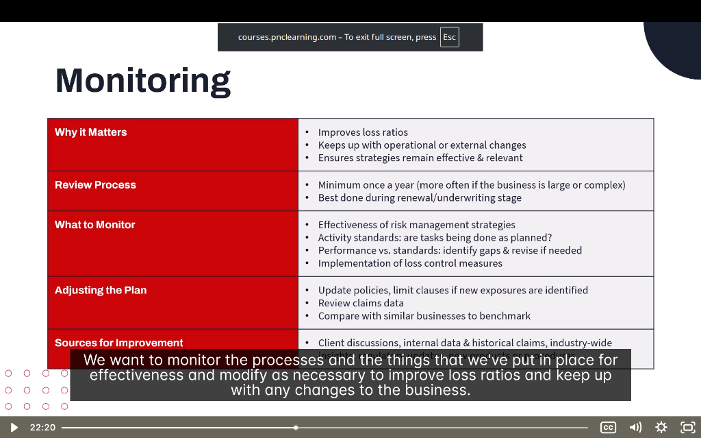

# 📈 Monitoring

> **Module:** Introduction | **Source:** PNC Learning - Demo RIBO 1 Sample Lecture

---

## 📸 Lecture Screenshot

---

## Overview

Risk management doesn't end once you've implemented strategies. You need to **continuously monitor** to ensure everything is working and stays relevant.

> 💡 **Key Concept:** Monitor the processes and strategies for effectiveness, and modify as necessary to improve loss ratios and keep up with business changes.

---

## 🗂️ Key Topics

| Topic | Description |
|-------|-------------|
| **Why it Matters** | Benefits of ongoing monitoring |
| **Review Process** | When and how to review |
| **What to Monitor** | Key areas to track |
| **Adjusting the Plan** | How to make changes |
| **Sources for Improvement** | Where to get insights |

---

## 1️⃣ Why Monitoring Matters

### Three Key Benefits:

| Benefit | Explanation |
|---------|-------------|
| **Improves Loss Ratios** | Fewer claims = better ratios = lower premiums |
| **Keeps Up with Changes** | Operational or external changes create new risks |
| **Ensures Relevance** | Strategies that worked before may not work now |

---

### What is a Loss Ratio?

> **Loss Ratio = Claims Paid ÷ Premiums Collected**

| Loss Ratio | What It Means | Outcome |
|------------|---------------|---------|
| < 50% | Low claims relative to premiums | ✅ Good for insurer and client |
| 50-70% | Typical range | ⚠️ Acceptable |
| > 80% | High claims relative to premiums | ❌ Premium increases or non-renewal |

### Real-Life Example:
> **Manufacturing Company:**
> 
> Year 1: No monitoring, 5 workplace injuries, $150,000 in claims  
> Year 2: Implemented monitoring, caught unsafe behaviors, 1 injury, $20,000 in claims
> 
> **Result:** Loss ratio improved, insurer offered **15% premium discount** for Year 3!

---

### Why Changes Require Monitoring:

| Type of Change | New Risk Created |
|----------------|------------------|
| New equipment | Operator injuries, maintenance needs |
| New location | Different fire/crime risks |
| New employees | Training gaps, inexperience |
| New products | Product liability exposures |
| Regulatory changes | Compliance requirements |
| Economic changes | Theft increases during recessions |

---

## 2️⃣ Review Process

### When to Review:

| Timing | Description |
|--------|-------------|
| **Minimum once a year** | Annual review is the absolute minimum |
| **More often if complex** | Large or complex businesses need quarterly reviews |
| **During renewal stage** | Best time — aligns with underwriting |
| **After major changes** | New location, acquisition, product launch |
| **After significant claims** | Learn from what went wrong |

---

### The Renewal/Underwriting Stage

This is the **ideal time** to review risk management:

| Why Renewal Time Works | Benefit |
|------------------------|---------|
| Insurance data is fresh | Recent claims info available |
| Broker is already involved | Natural touchpoint |
| Client is thinking about risk | Premium bill focuses attention |
| Can negotiate better terms | Good loss history = better rates |

### Real-Life Example:
> **Annual Insurance Renewal Meeting:**
> 
> Broker: "Let's review your loss history and risk management before renewal."
> 
> | Discussion Point | Finding | Action |
> |------------------|---------|--------|
> | Claims last year | 3 slip-and-fall claims | Add more floor mats |
> | New operations | Opened second location | Add to policy |
> | Safety training | Staff not trained | Schedule training |
> 
> **Result:** Better risk profile → lower premium increase.

---

## 3️⃣ What to Monitor

### Four Key Areas:

| Area | What to Check |
|------|---------------|
| **Effectiveness of Strategies** | Are risk management measures actually working? |
| **Activity Standards** | Are tasks being done as planned? |
| **Performance vs. Standards** | Identify gaps and revise if needed |
| **Loss Control Measures** | Are they properly implemented? |

---

### 📌 Effectiveness of Risk Management Strategies

**Question:** Are your strategies actually reducing losses?

| Measure | How to Evaluate |
|---------|-----------------|
| Fewer claims? | Compare year-over-year claims data |
| Lower severity? | Compare average claim cost |
| Near-misses decreasing? | Track incidents that almost caused losses |
| Compliance improving? | Audit inspection results |

**Example:**
> Installed security cameras 6 months ago.
> 
> | Before Cameras | After Cameras |
> |----------------|---------------|
> | 4 theft claims/year | 1 theft claim/year |
> 
> **Conclusion:** Strategy is effective! ✅

---

### 📌 Activity Standards

**Question:** Are people doing what they're supposed to do?

| Standard | Monitoring Method |
|----------|-------------------|
| Monthly fire drills | Check drill log |
| Weekly equipment inspection | Review checklists |
| Daily safety briefing | Observe/audit |
| Quarterly training | Verify completion records |

**Example:**
> Policy requires monthly fire extinguisher inspections.
> 
> **Monitoring reveals:** Only 3 of 12 months were checked.
> 
> **Action:** Assign responsibility, create calendar reminder, hold staff accountable.

---

### 📌 Performance vs. Standards

**Question:** Where are the gaps between what should happen and what actually happens?

| Standard | Actual Performance | Gap |
|----------|-------------------|-----|
| 100% staff trained | 75% trained | 25% gap |
| Zero slip-and-fall claims | 2 claims | Not meeting target |
| All alarms tested monthly | Tested quarterly | Frequency gap |

**Action:** Identify WHY gaps exist and fix the root cause.

---

### 📌 Implementation of Loss Control Measures

**Question:** Are the physical and procedural controls in place and working?

| Control | What to Check |
|---------|---------------|
| Sprinklers | Tested regularly? No obstructions? |
| Alarms | Properly armed? Monitored? |
| Training programs | Current content? Attendance? |
| Safety equipment | Available? In good condition? |

---

## 4️⃣ Adjusting the Plan

Risk management plans must evolve. Here's how to adjust:

### When to Adjust:

| Trigger | Action |
|---------|--------|
| **New exposures identified** | Update policies, add limit clauses |
| **Claims data shows patterns** | Address root causes |
| **Benchmark comparison** | Learn from similar businesses |

---

### 📌 Update Policies and Limits

When new risks are identified:

| New Exposure | Policy Update |
|--------------|---------------|
| Started delivery service | Add commercial auto coverage |
| Hired contractors | Require certificates of insurance |
| Added swimming pool | Increase liability limits |
| Stored customer data | Add cyber liability coverage |

---

### 📌 Review Claims Data

Claims data tells a story. Look for patterns:

| Pattern | What It Suggests | Action |
|---------|------------------|--------|
| Multiple back injuries | Lifting techniques are poor | Training + equipment |
| Claims on Mondays | Weekend activities causing injuries | Investigate |
| One location has more claims | Site-specific hazard | Investigate that location |
| Same employee involved | Training issue or problem employee | Address directly |

---

### 📌 Benchmark with Similar Businesses

Compare your performance to industry peers:

| Metric | Your Business | Industry Average | Analysis |
|--------|---------------|------------------|----------|
| Claims per employee | 0.15 | 0.10 | Above average → investigate |
| Loss ratio | 55% | 60% | Below average → good! |
| Training hours | 4 hrs/year | 8 hrs/year | Below average → increase |

> 💡 **Benchmarking sources:** Industry associations, insurance company reports, broker data

---

## 5️⃣ Sources for Improvement

Where to get ideas to improve your risk management:

### Three Main Sources:

| Source | What You Learn |
|--------|----------------|
| **Client Discussions** | On-the-ground insights, operational changes |
| **Internal Data** | Historical claims, near-miss reports, audits |
| **Industry-Wide Data** | Trends, best practices, benchmarks |

---

### 📌 Client Discussions

Talk to the client regularly! They know their business best.

| Question to Ask | Why It Matters |
|-----------------|----------------|
| "Any changes in operations?" | Identifies new exposures |
| "Any near-misses lately?" | Finds problems before claims |
| "How's the safety program going?" | Checks implementation |
| "Any concerns about coverage?" | Addresses gaps |

---

### 📌 Internal Data & Historical Claims

Your own data is gold:

| Data Source | Insight |
|-------------|---------|
| Claims history | What types of losses occur? |
| Incident reports | What almost went wrong? |
| Inspection results | Where are the deficiencies? |
| Training records | Who needs more training? |

---

### 📌 Industry-Wide Data

Learn from others:

| Source | Information |
|--------|-------------|
| Insurance company loss reports | Common claims in your industry |
| Industry associations | Best practices, safety guidelines |
| Government (WSIB, MOL) | Regulatory requirements, statistics |
| Trade publications | Emerging risks, new solutions |

---

## 📝 Quick Summary Table

| Area | Key Question |
|------|--------------|
| **Why Monitor** | Is our risk management working? |
| **Review Process** | Are we reviewing often enough? |
| **What to Monitor** | Are strategies, activities, and controls effective? |
| **Adjusting** | What needs to change based on data? |
| **Improvement Sources** | Where can we learn to get better? |

---

## 🧠 Practice Question

> A business has had the same risk management plan for 5 years. In the past year, they opened a new location, hired 20 new employees, and added a product line. Their loss ratio has increased from 50% to 75%.
> 
> What should they do FIRST?
> 
> a) Cancel their insurance and find a new provider  
> b) Conduct a comprehensive review of their risk management plan  
> c) Increase all deductibles to lower premiums  
> d) Blame the new employees and terminate them

Click to reveal answer

**Answer: b) Conduct a comprehensive review of their risk management plan**

The business has undergone significant changes (new location, employees, products) but hasn't updated their risk management. The increasing loss ratio indicates their old plan isn't addressing new risks.

A comprehensive review will:
- Identify new exposures from the changes
- Determine what's causing the increased claims
- Update strategies to address current risks

**Why not the others:**
- a) Changing insurers doesn't fix the underlying risk issues
- c) Higher deductibles don't address the root cause
- d) This is discriminatory and likely not the actual problem

---

## 🎓 Key RIBO Takeaways

1. **Monitoring is ongoing** — not a one-time event
2. **Review at least annually** — more often for complex businesses
3. **Best time to review:** During insurance renewal
4. **Monitor 4 things:** Effectiveness, activities, performance gaps, controls
5. **Use 3 data sources:** Client discussions, internal data, industry data
6. **Adjust the plan** when claims data or new exposures require it

---

*← Back to: [Select & Implement](./06-select-and-implement.md)*
