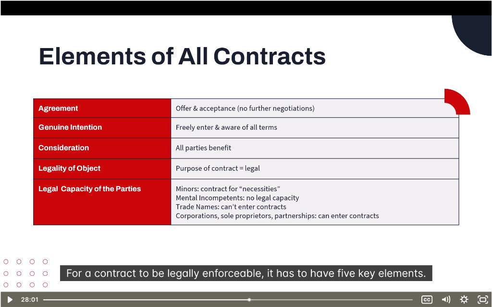

# 📜 Contracts

> **Module:** Introduction | **Source:** PNC Learning - Demo RIBO 1 Sample Lecture

---

## 📸 Lecture Screenshot

---

## Overview

> **A contract is a legally enforceable agreement for somebody to do or not do something.**

Understanding contracts is essential for insurance brokers because:
- Insurance policies ARE contracts
- Liability can arise from breach of contract
- Contractual obligations affect coverage

---

## 🗂️ Key Concepts

| Concept | Definition |
|---------|------------|
| **Contract** | Legally enforceable agreement |
| **Express Contract** | Written, clearly defined terms |
| **Implied Contract** | Based on actions/conduct, not written |
| **Legally Enforceable** | Courts will enforce the terms |
| **Duty of Care** | Obligation to avoid causing harm |

---

## 1️⃣ What is a Contract?

**Definition:** A **legally enforceable agreement** between two or more parties to do (or not do) something.

### Essential Elements of a Valid Contract:

| Element | Description | Example |
|---------|-------------|---------|
| **Offer** | One party proposes terms | "I'll sell you my car for $10,000" |
| **Acceptance** | Other party agrees to terms | "I accept. Deal!" |
| **Consideration** | Something of value exchanged | Money for the car |
| **Capacity** | Parties are legally able to contract | Adults, not mentally incapacitated |
| **Legality** | Purpose must be legal | Can't contract for illegal activities |
| **Intent** | Parties intend to be bound | Not a joke or social agreement |

### Insurance as a Contract:

> 💡 **An insurance policy is a contract between the insured and the insurer!**

| Contract Element | In Insurance |
|------------------|--------------|
| Offer | Application for insurance |
| Acceptance | Insurer issues the policy |
| Consideration | Premium paid by insured |
| Promise | Insurer will pay covered claims |

---

## 2️⃣ Express Contracts

**Definition:** Contracts where terms are **explicitly stated**, either in writing or verbally.

### Characteristics:

| Feature | Description |
|---------|-------------|
| **Written** | Terms are documented |
| **Clearly defined** | No ambiguity about obligations |
| **Legally binding** | Enforceable in court |

### Examples of Express Contracts:

| Contract Type | Example |
|---------------|---------|
| Insurance policy | Written terms, conditions, exclusions |
| Lease agreement | Landlord and tenant rights/obligations |
| Employment contract | Salary, duties, termination terms |
| Sales agreement | Price, delivery terms, warranties |
| Construction contract | Scope of work, timeline, payment |

### Real-Life Example:
> **Commercial Insurance Policy:**
> 
> The policy document explicitly states:
> - Coverage limits: $1,000,000
> - Deductible: $5,000
> - Named perils: Fire, theft, vandalism
> - Exclusions: Flood, earthquake
> 
> All terms are **express** — written and clear.

---

## 3️⃣ Implied Contracts

**Definition:** Contracts that are **not explicitly stated** but are understood based on actions, conduct, or circumstances.

### Characteristics:

| Feature | Description |
|---------|-------------|
| **Based on actions** | Conduct creates the agreement |
| **Oral or inferred** | May not be written down |
| **Legally enforceable** | Courts recognize these |
| **More ambiguous** | Can be harder to prove |

### Two Types of Implied Contracts:

| Type | How It's Created | Example |
|------|------------------|---------|
| **Implied-in-Fact** | Actions of parties | Going to a restaurant implies you'll pay for food |
| **Implied-in-Law** (Quasi-Contract) | Court imposes to prevent unjust enrichment | Emergency room treats unconscious patient |

### Examples of Implied Contracts:

| Situation | Implied Agreement |
|-----------|-------------------|
| Getting on a bus | You'll pay the fare |
| Eating at a restaurant | You'll pay for the meal |
| Visiting a doctor | You'll pay for services rendered |
| Hiring a professional | Standard duty of care applies |

### Real-Life Example:
> **Broker-Client Relationship:**
> 
> A client calls their broker and says, "Find me the best car insurance."
> 
> Even without a written contract, there's an **implied agreement** that:
> - The broker will act in the client's best interest
> - The broker will use professional skill and care
> - The client will pay for the broker's services
> 
> This is why brokers can be sued for negligence even without a signed engagement letter!

---

## 4️⃣ Legally Enforceable

**Definition:** The court will **agree to enforce** the terms of the contract if one party doesn't comply.

### What Makes a Contract Enforceable?

| Requirement | Why It Matters |
|-------------|----------------|
| Valid formation | All essential elements present |
| Clear terms | Court can understand what was agreed |
| Legal purpose | Can't enforce illegal agreements |
| Proper capacity | Parties could legally enter contract |
| Written (sometimes) | Some contracts must be in writing |

### Statute of Frauds — Contracts That MUST Be Written:

| Type | Why |
|------|-----|
| Real estate sales | High value, long-term |
| Contracts > 1 year | Long duration |
| Guarantees/suretyship | Third-party promises |
| Insurance policies | Regulated industry |

### What Happens When a Contract is Breached?

| Remedy | Description |
|--------|-------------|
| **Damages** | Money to compensate for loss |
| **Specific Performance** | Court orders performance of the contract |
| **Rescission** | Contract is cancelled |
| **Injunction** | Court order to stop doing something |

### Real-Life Example:
> **Insurance Claim Dispute:**
> 
> An insured has a fire loss and files a claim. The insurer denies the claim, arguing it was arson.
> 
> The insured sues to **enforce the contract** (the policy).
> 
> The court will:
> 1. Look at the policy terms (express contract)
> 2. Determine if coverage applies
> 3. Order the insurer to pay if the claim is valid

---

## 5️⃣ Duty of Care

**Definition:** The **legal obligation to act responsibly** to avoid causing harm to others.

### Two Levels of Duty of Care:

| Level | Owed To | Standard |
|-------|---------|----------|
| **General Duty** | Everyone | Prevent foreseeable harm |
| **Specific Duty** | Special relationships | Higher responsibility |

---

### General Duty of Care

**Owed to:** Everyone in society

**Standard:** Act reasonably to prevent **foreseeable harm**.

| Example | Duty |
|---------|------|
| Driving a car | Don't drive recklessly |
| Owning property | Keep premises safe |
| Manufacturing products | Ensure products are safe |
| Providing services | Perform competently |

### The "Reasonable Person" Test:

> Would a **reasonable person** have foreseen that their actions could cause harm?

If yes, and they didn't take precautions, they breached their duty of care.

---

### Specific Duty of Care

**Owed to:** People in **special relationships** where one party depends on the other.

| Relationship | Higher Duty Because |
|--------------|---------------------|
| Doctor → Patient | Patient relies on medical expertise |
| Lawyer → Client | Client relies on legal advice |
| **Insurance Broker → Client** | Client relies on broker's expertise |
| Teacher → Student | Students are vulnerable |
| Employer → Employee | Employees follow employer's direction |

### Broker's Duty of Care:

> ⚠️ **As a broker, you have a SPECIFIC duty of care to your clients!**

| Broker's Duty | What It Means |
|---------------|---------------|
| Assess client's needs | Understand their risks properly |
| Recommend appropriate coverage | Don't leave gaps |
| Explain policy terms | Client should understand what they're buying |
| Act in client's best interest | Not just your commission interest |
| Follow up | Ensure coverage stays current |

### Real-Life Example:
> **Broker Negligence Case:**
> 
> A client asks their broker for "full coverage" on their business.
> The broker sells them property insurance but NOT business interruption.
> A fire occurs, the business is closed for 6 months, and the client loses $500,000 in income.
> 
> **Client sues broker for negligence:**
> - Broker had a **specific duty of care**
> - Broker failed to assess needs properly
> - Broker failed to recommend appropriate coverage
> 
> **Result:** Broker may be held liable for the client's uninsured losses!

---

## 📝 Quick Summary Table

| Concept | Key Point |
|---------|-----------|
| **Contract** | Legally enforceable agreement |
| **Express** | Written, clearly defined |
| **Implied** | Actions/conduct, inferred |
| **Enforceable** | Court will uphold terms |
| **Duty of Care** | Act responsibly to prevent harm |

---

## 🧠 Practice Question

> A broker verbally promises a client, "I'll make sure you have the best coverage for your restaurant." The broker fails to include liquor liability, and the client is later sued for $200,000 after a patron drives drunk.
> 
> On what basis could the client sue the broker?
> 
> a) Breach of express contract only  
> b) Breach of implied contract and duty of care  
> c) The client has no legal recourse  
> d) Criminal negligence

Click to reveal answer

**Answer: b) Breach of implied contract and duty of care**

**Implied Contract:**
- The broker's verbal promise created an implied agreement
- Even without a written contract, the broker agreed to provide appropriate coverage

**Duty of Care:**
- As a broker, there's a specific duty of care to the client
- The broker failed to assess the client's exposure to liquor liability
- A reasonable broker would have known restaurants serving alcohol need liquor liability

**Why not the others:**
- a) There was no written/express contract, but implied still applies
- c) The client definitely has legal recourse
- d) This is civil negligence, not criminal

---

## 🎓 Key RIBO Takeaways

1. **Insurance policies ARE contracts** — legally enforceable
2. **Express contracts** are written and clear; **implied contracts** arise from conduct
3. **Brokers have a specific duty of care** — higher than the general public
4. **Breach of duty** can lead to lawsuits against brokers
5. **Always document** broker-client communications (protect yourself!)
6. **The "reasonable person" test** determines if duty of care was breached

---

## 📸 Part 2: Elements of All Contracts

---

## 6️⃣ The 5 Essential Elements

> **For a contract to be legally enforceable, it MUST have these 5 elements:**

| Element | Description |
|---------|-------------|
| **Agreement** | Offer & acceptance (no further negotiations) |
| **Genuine Intention** | Freely enter & aware of all terms |
| **Consideration** | All parties benefit |
| **Legality of Object** | Purpose of contract = legal |
| **Legal Capacity of the Parties** | Parties are legally able to contract |

---

### 📌 Element 1: Agreement

**Definition:** A valid **offer** has been made and **accepted** without further negotiation needed.

| Component | Requirement |
|-----------|-------------|
| **Offer** | Clear, definite terms proposed |
| **Acceptance** | Unconditional agreement to the offer |
| **Communication** | Both parties aware of offer and acceptance |

#### What Breaks an Agreement:

| Issue | Problem |
|-------|---------|
| **Counter-offer** | Changes the terms = no agreement yet |
| **Conditional acceptance** | "I accept IF..." = no agreement |
| **Withdrawal** | Offer can be withdrawn before accepted |
| **Rejection** | Declines the offer |

#### Real-Life Example:
> **Insurance Application:**
> 
> 1. Client applies for insurance (offer)
> 2. Insurer reviews application
> 3. Insurer issues policy (acceptance)
> 
> **Agreement is formed** when policy is issued.

---

### 📌 Element 2: Genuine Intention

**Definition:** Both parties **freely enter** the contract and are **fully aware** of all terms.

| Requirement | What It Means |
|-------------|---------------|
| **Freely enter** | No force, threats, or undue pressure |
| **Aware of terms** | Understand what they're agreeing to |
| **No deception** | No fraud or misrepresentation |

#### What Invalidates Genuine Intention:

| Vitiating Factor | Description | Example |
|------------------|-------------|---------|
| **Duress** | Forced into contract by threats | "Sign or I'll hurt you" |
| **Undue Influence** | Pressure from position of power | Lawyer pressures elderly client |
| **Misrepresentation** | False statements induced contract | Seller lies about product quality |
| **Mistake** | Fundamental error about subject matter | Both parties wrong about what's being sold |
| **Fraud** | Intentional deception | Forged documents |

#### Real-Life Example:
> **Insurance Misrepresentation:**
> 
> An applicant lies on their application about their driving history (3 DUIs hidden).
> 
> The insurer issues a policy based on false information.
> 
> **Result:** If discovered, the insurer can **void the contract** because there was no genuine intention — the contract was based on fraud.

---

### 📌 Element 3: Consideration

**Definition:** Something of **value exchanged** between parties — ALL parties must benefit.

| Party | What They Give | What They Get |
|-------|----------------|---------------|
| Insured | Premium payments | Promise to pay claims |
| Insurer | Promise to pay claims | Premium payments |

#### Key Rules:

| Rule | Explanation |
|------|-------------|
| Must be valuable | Courts don't assess adequacy, just existence |
| Must be legal | Can't be illegal goods/services |
| Must be present | Past consideration doesn't count |
| Must flow both ways | One-sided promises aren't contracts |

#### What Counts as Consideration:

| Valid | Not Valid |
|-------|-----------|
| Money | Love and affection (in most cases) |
| Goods or services | Past favors ("I already did X for you") |
| Promise to do something | Doing something you're already obligated to do |
| Promise NOT to do something | Vague promises |

#### Real-Life Example:
> **Insurance Premium as Consideration:**
> 
> - **Insured's consideration:** $1,200/year premium
> - **Insurer's consideration:** Promise to pay up to $500,000 if covered loss occurs
> 
> Both parties give something of value = valid consideration.

---

### 📌 Element 4: Legality of Object

**Definition:** The **purpose** of the contract must be **legal**.

| Legal Contracts | Illegal Contracts |
|-----------------|-------------------|
| Selling a car | Selling stolen goods |
| Insurance policy | Insurance for illegal activities |
| Employment agreement | Contract to commit a crime |
| Lease agreement | Contract to evade taxes |

#### What Makes a Contract Illegal:

| Issue | Example |
|-------|---------|
| Criminal activity | Contract to smuggle drugs |
| Violation of public policy | Contract restricting someone's right to work |
| Statutory prohibition | Unlicensed person practicing medicine |
| Against regulations | Broker operating without RIBO license |

#### Real-Life Example:
> **Unenforceable Insurance:**
> 
> A person tries to buy fire insurance on a building they don't own (no insurable interest).
> 
> **Result:** The contract is **unenforceable** because it would encourage arson — against public policy.

> ⚠️ **RIBO Note:** An unlicensed person cannot legally sell insurance in Ontario. Any "contracts" they make are void!

---

### 📌 Element 5: Legal Capacity of the Parties

**Definition:** The parties must have the **legal ability** to enter into contracts.

#### Who CAN Enter Contracts:

| Entity | Capacity |
|--------|----------|
| **Adult individuals** (18+ in Ontario) | Full capacity ✅ |
| **Corporations** | Can contract ✅ |
| **Sole proprietors** | Can contract ✅ |
| **Partnerships** | Can contract ✅ |

#### Who Has LIMITED or NO Capacity:

| Category | Capacity | Notes |
|----------|----------|-------|
| **Minors** (under 18) | Limited | Can only contract for "necessities" (food, shelter, clothing) |
| **Mental incompetents** | None | Cannot form valid contracts |
| **Intoxicated persons** | Limited | Depends on level of impairment |
| **Trade Names** | None | Trade names can't enter contracts — the person/entity behind it must |

#### What Are "Necessities" for Minors?

| Necessity | Not a Necessity |
|-----------|-----------------|
| Food | Luxury car |
| Clothing | Entertainment |
| Shelter | Jewelry |
| Medical care | Investment products |
| Basic education | Credit cards |

#### Real-Life Example:
> **Minor Trying to Buy Insurance:**
> 
> A 16-year-old tries to buy car insurance.
> 
> **Problem:** The minor lacks full legal capacity.
> 
> **Solution:** A parent or guardian must be the policyholder. The minor can be a named driver but not the contracting party.

#### Trade Names vs. Legal Entities:

> ⚠️ **Important Distinction:**

| Trade Name | Legal Entity |
|------------|--------------|
| "Joe's Coffee Shop" (just a business name) | Joe Smith (the person) OR "Joe's Coffee Shop Inc." (if incorporated) |
| Cannot sign contracts on its own | CAN sign contracts |
| Not a legal "person" | Is a legal "person" |

**Example:**
> A policy must be in the name of "John Smith, operating as Joe's Coffee Shop" OR "Joe's Coffee Shop Inc." — NOT just "Joe's Coffee Shop" alone.

---

## 🧠 Practice Question #2

> A 17-year-old signs a contract to buy a car for $15,000. One week later, they want to cancel the contract. Can they?
> 
> a) No, contracts are always binding  
> b) Yes, because minors have no capacity to contract  
> c) Yes, because a car is not a "necessity"  
> d) Only if the seller agrees

Click to reveal answer

**Answer: c) Yes, because a car is not a "necessity"**

Minors (under 18) have **limited capacity** to contract. They can only be bound by contracts for **necessities** (food, shelter, clothing, medical care, basic education).

A car (especially for $15,000) is NOT a necessity. The minor can **void** the contract.

**Why not the others:**
- a) Contracts with minors are voidable, not always binding
- b) Minors have LIMITED capacity, not NO capacity — they can contract for necessities
- d) The minor can void unilaterally; seller's agreement isn't required

---

## 🎓 Additional RIBO Takeaways

7. **5 Essential Elements:** Agreement, Genuine Intention, Consideration, Legality, Capacity
8. **All 5 must be present** for a valid, enforceable contract
9. **Fraud/misrepresentation** can void an insurance contract
10. **Minors can only contract for necessities** — car insurance needs a parent as policyholder
11. **Trade names can't contract** — must be the legal person/entity
12. **Illegal contracts are unenforceable** — including insurance without insurable interest

---

*← Back to: [Monitoring](./07-monitoring.md)*

