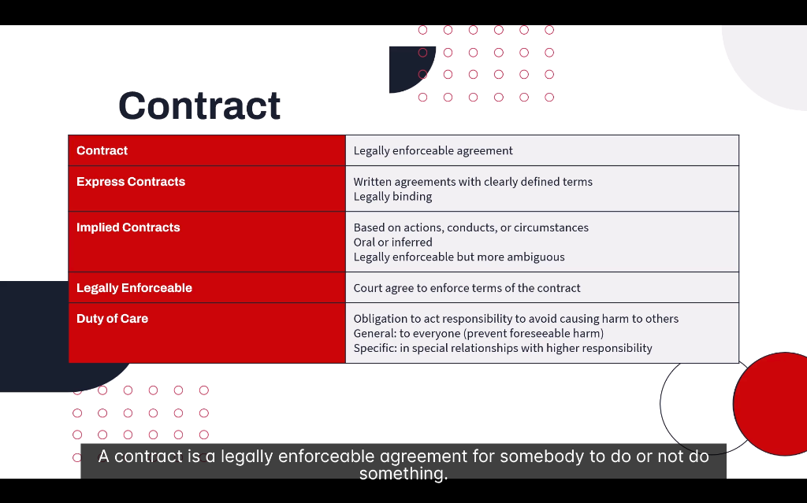

# 📜 Contracts

> **Module:** Introduction | **Source:** PNC Learning - Demo RIBO 1 Sample Lecture

---

## 📸 Lecture Screenshot

---

## Overview

> **A contract is a legally enforceable agreement for somebody to do or not do something.**

Understanding contracts is essential for insurance brokers because:
- Insurance policies ARE contracts
- Liability can arise from breach of contract
- Contractual obligations affect coverage

---

## 🗂️ Key Concepts

| Concept | Definition |
|---------|------------|
| **Contract** | Legally enforceable agreement |
| **Express Contract** | Written, clearly defined terms |
| **Implied Contract** | Based on actions/conduct, not written |
| **Legally Enforceable** | Courts will enforce the terms |
| **Duty of Care** | Obligation to avoid causing harm |

---

## 1️⃣ What is a Contract?

**Definition:** A **legally enforceable agreement** between two or more parties to do (or not do) something.

### Essential Elements of a Valid Contract:

| Element | Description | Example |
|---------|-------------|---------|
| **Offer** | One party proposes terms | "I'll sell you my car for $10,000" |
| **Acceptance** | Other party agrees to terms | "I accept. Deal!" |
| **Consideration** | Something of value exchanged | Money for the car |
| **Capacity** | Parties are legally able to contract | Adults, not mentally incapacitated |
| **Legality** | Purpose must be legal | Can't contract for illegal activities |
| **Intent** | Parties intend to be bound | Not a joke or social agreement |

### Insurance as a Contract:

> 💡 **An insurance policy is a contract between the insured and the insurer!**

| Contract Element | In Insurance |
|------------------|--------------|
| Offer | Application for insurance |
| Acceptance | Insurer issues the policy |
| Consideration | Premium paid by insured |
| Promise | Insurer will pay covered claims |

---

## 2️⃣ Express Contracts

**Definition:** Contracts where terms are **explicitly stated**, either in writing or verbally.

### Characteristics:

| Feature | Description |
|---------|-------------|
| **Written** | Terms are documented |
| **Clearly defined** | No ambiguity about obligations |
| **Legally binding** | Enforceable in court |

### Examples of Express Contracts:

| Contract Type | Example |
|---------------|---------|
| Insurance policy | Written terms, conditions, exclusions |
| Lease agreement | Landlord and tenant rights/obligations |
| Employment contract | Salary, duties, termination terms |
| Sales agreement | Price, delivery terms, warranties |
| Construction contract | Scope of work, timeline, payment |

### Real-Life Example:
> **Commercial Insurance Policy:**
> 
> The policy document explicitly states:
> - Coverage limits: $1,000,000
> - Deductible: $5,000
> - Named perils: Fire, theft, vandalism
> - Exclusions: Flood, earthquake
> 
> All terms are **express** — written and clear.

---

## 3️⃣ Implied Contracts

**Definition:** Contracts that are **not explicitly stated** but are understood based on actions, conduct, or circumstances.

### Characteristics:

| Feature | Description |
|---------|-------------|
| **Based on actions** | Conduct creates the agreement |
| **Oral or inferred** | May not be written down |
| **Legally enforceable** | Courts recognize these |
| **More ambiguous** | Can be harder to prove |

### Two Types of Implied Contracts:

| Type | How It's Created | Example |
|------|------------------|---------|
| **Implied-in-Fact** | Actions of parties | Going to a restaurant implies you'll pay for food |
| **Implied-in-Law** (Quasi-Contract) | Court imposes to prevent unjust enrichment | Emergency room treats unconscious patient |

### Examples of Implied Contracts:

| Situation | Implied Agreement |
|-----------|-------------------|
| Getting on a bus | You'll pay the fare |
| Eating at a restaurant | You'll pay for the meal |
| Visiting a doctor | You'll pay for services rendered |
| Hiring a professional | Standard duty of care applies |

### Real-Life Example:
> **Broker-Client Relationship:**
> 
> A client calls their broker and says, "Find me the best car insurance."
> 
> Even without a written contract, there's an **implied agreement** that:
> - The broker will act in the client's best interest
> - The broker will use professional skill and care
> - The client will pay for the broker's services
> 
> This is why brokers can be sued for negligence even without a signed engagement letter!

---

## 4️⃣ Legally Enforceable

**Definition:** The court will **agree to enforce** the terms of the contract if one party doesn't comply.

### What Makes a Contract Enforceable?

| Requirement | Why It Matters |
|-------------|----------------|
| Valid formation | All essential elements present |
| Clear terms | Court can understand what was agreed |
| Legal purpose | Can't enforce illegal agreements |
| Proper capacity | Parties could legally enter contract |
| Written (sometimes) | Some contracts must be in writing |

### Statute of Frauds — Contracts That MUST Be Written:

| Type | Why |
|------|-----|
| Real estate sales | High value, long-term |
| Contracts > 1 year | Long duration |
| Guarantees/suretyship | Third-party promises |
| Insurance policies | Regulated industry |

### What Happens When a Contract is Breached?

| Remedy | Description |
|--------|-------------|
| **Damages** | Money to compensate for loss |
| **Specific Performance** | Court orders performance of the contract |
| **Rescission** | Contract is cancelled |
| **Injunction** | Court order to stop doing something |

### Real-Life Example:
> **Insurance Claim Dispute:**
> 
> An insured has a fire loss and files a claim. The insurer denies the claim, arguing it was arson.
> 
> The insured sues to **enforce the contract** (the policy).
> 
> The court will:
> 1. Look at the policy terms (express contract)
> 2. Determine if coverage applies
> 3. Order the insurer to pay if the claim is valid

---

## 5️⃣ Duty of Care

**Definition:** The **legal obligation to act responsibly** to avoid causing harm to others.

### Two Levels of Duty of Care:

| Level | Owed To | Standard |
|-------|---------|----------|
| **General Duty** | Everyone | Prevent foreseeable harm |
| **Specific Duty** | Special relationships | Higher responsibility |

---

### General Duty of Care

**Owed to:** Everyone in society

**Standard:** Act reasonably to prevent **foreseeable harm**.

| Example | Duty |
|---------|------|
| Driving a car | Don't drive recklessly |
| Owning property | Keep premises safe |
| Manufacturing products | Ensure products are safe |
| Providing services | Perform competently |

### The "Reasonable Person" Test:

> Would a **reasonable person** have foreseen that their actions could cause harm?

If yes, and they didn't take precautions, they breached their duty of care.

---

### Specific Duty of Care

**Owed to:** People in **special relationships** where one party depends on the other.

| Relationship | Higher Duty Because |
|--------------|---------------------|
| Doctor → Patient | Patient relies on medical expertise |
| Lawyer → Client | Client relies on legal advice |
| **Insurance Broker → Client** | Client relies on broker's expertise |
| Teacher → Student | Students are vulnerable |
| Employer → Employee | Employees follow employer's direction |

### Broker's Duty of Care:

> ⚠️ **As a broker, you have a SPECIFIC duty of care to your clients!**

| Broker's Duty | What It Means |
|---------------|---------------|
| Assess client's needs | Understand their risks properly |
| Recommend appropriate coverage | Don't leave gaps |
| Explain policy terms | Client should understand what they're buying |
| Act in client's best interest | Not just your commission interest |
| Follow up | Ensure coverage stays current |

### Real-Life Example:
> **Broker Negligence Case:**
> 
> A client asks their broker for "full coverage" on their business.
> The broker sells them property insurance but NOT business interruption.
> A fire occurs, the business is closed for 6 months, and the client loses $500,000 in income.
> 
> **Client sues broker for negligence:**
> - Broker had a **specific duty of care**
> - Broker failed to assess needs properly
> - Broker failed to recommend appropriate coverage
> 
> **Result:** Broker may be held liable for the client's uninsured losses!

---

## 📝 Quick Summary Table

| Concept | Key Point |
|---------|-----------|
| **Contract** | Legally enforceable agreement |
| **Express** | Written, clearly defined |
| **Implied** | Actions/conduct, inferred |
| **Enforceable** | Court will uphold terms |
| **Duty of Care** | Act responsibly to prevent harm |

---

## 🧠 Practice Question

> A broker verbally promises a client, "I'll make sure you have the best coverage for your restaurant." The broker fails to include liquor liability, and the client is later sued for $200,000 after a patron drives drunk.
> 
> On what basis could the client sue the broker?
> 
> a) Breach of express contract only  
> b) Breach of implied contract and duty of care  
> c) The client has no legal recourse  
> d) Criminal negligence

Click to reveal answer

**Answer: b) Breach of implied contract and duty of care**

**Implied Contract:**
- The broker's verbal promise created an implied agreement
- Even without a written contract, the broker agreed to provide appropriate coverage

**Duty of Care:**
- As a broker, there's a specific duty of care to the client
- The broker failed to assess the client's exposure to liquor liability
- A reasonable broker would have known restaurants serving alcohol need liquor liability

**Why not the others:**
- a) There was no written/express contract, but implied still applies
- c) The client definitely has legal recourse
- d) This is civil negligence, not criminal

---

## 🎓 Key RIBO Takeaways

1. **Insurance policies ARE contracts** — legally enforceable
2. **Express contracts** are written and clear; **implied contracts** arise from conduct
3. **Brokers have a specific duty of care** — higher than the general public
4. **Breach of duty** can lead to lawsuits against brokers
5. **Always document** broker-client communications (protect yourself!)
6. **The "reasonable person" test** determines if duty of care was breached

---

*← Back to: [Monitoring](./07-monitoring.md)*
