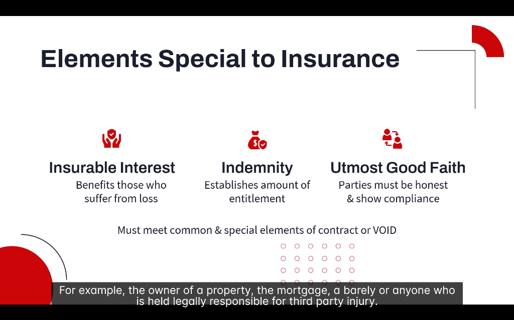
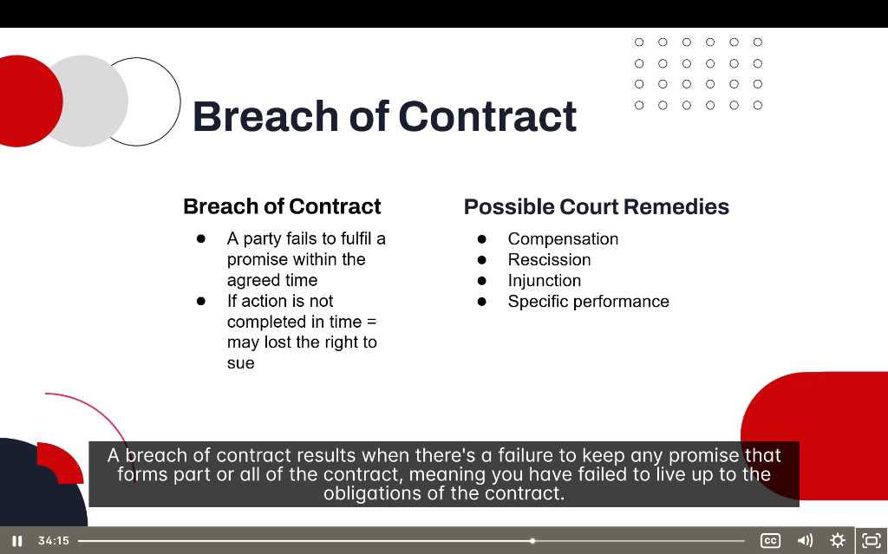

# 🛡️ Elements Special to Insurance Contracts

> **Module:** Introduction | **Source:** PNC Learning - Demo RIBO 1 Sample Lecture

---

## 📸 Lecture Screenshots

---

## Overview

Insurance contracts are **special contracts** that must meet:
1. **Common elements** (Agreement, Intention, Consideration, Legality, Capacity)
2. **PLUS special elements** unique to insurance

> ⚠️ **If either set of elements is missing = Contract is VOID!**

---

## 🗂️ The 3 Special Elements of Insurance

| Element | Definition |
|---------|------------|
| **Insurable Interest** | Benefits those who suffer from loss |
| **Indemnity** | Establishes amount of entitlement |
| **Utmost Good Faith** | Parties must be honest & show compliance |

---

## 1️⃣ Insurable Interest

**Definition:** You must have a **financial stake** in the property or person being insured. If a loss occurs, you must actually **suffer financially**.

> 💡 **Key Principle:** Insurance is meant to protect against loss, NOT to create profit.

### Who Has Insurable Interest?

| Person | Why They Have Insurable Interest |
|--------|----------------------------------|
| **Property owner** | They own it; destruction = financial loss |
| **Mortgagee (lender)** | They have a security interest in property |
| **Bailee** (holding goods for others) | Legally responsible for the goods |
| **Tenant** | Has interest in contents and may be liable for damage |
| **Anyone legally responsible** | Could be sued for third-party injuries |

### Examples of Insurable Interest:

| Scenario | Has Insurable Interest? | Why? |
|----------|------------------------|------|
| You insure your own car | ✅ Yes | You own it |
| You insure your neighbor's car | ❌ No | You don't suffer if it's destroyed |
| Bank insures mortgaged property | ✅ Yes | They've lent money against it |
| Landlord insures rental building | ✅ Yes | They own it |
| Tenant insures their furniture | ✅ Yes | They own the contents |
| You insure your spouse's life | ✅ Yes | Financial dependency |

### When Must Insurable Interest Exist?

| Type of Insurance | When Interest Must Exist |
|-------------------|-------------------------|
| **Property Insurance** | At the time of **loss** |
| **Life Insurance** | At **inception** (start) of policy |

#### Real-Life Example:
> **Property Sale Scenario:**
> 
> John sells his house on January 15. His property insurance runs until December 31.
> 
> On February 1, the house burns down.
> 
> **Can John collect on the insurance?**
> 
> ❌ **No!** John no longer has insurable interest — he doesn't own the property anymore. He suffered no financial loss.

### Why Insurable Interest Matters:

| With Insurable Interest | Without Insurable Interest |
|------------------------|---------------------------|
| Valid insurance contract | Contract is VOID |
| Claim will be paid | Claim will be denied |
| Prevents gambling | Would encourage arson/fraud |
| Moral: protect from loss | Immoral: profit from destruction |

---

## 2️⃣ Indemnity

**Definition:** The principle that insurance should **restore you to the same financial position** you were in before the loss — no better, no worse.

> 💡 **Key Principle:** You cannot PROFIT from insurance.

### What Indemnity Means:

| Concept | Explanation |
|---------|-------------|
| **Restore** | Put insured back to pre-loss position |
| **No profit** | Can't make money from a claim |
| **Actual loss** | Payment based on actual financial loss |
| **Entitlement** | Establishes how much you can receive |

### How Indemnity Works:

| Your Car's Value | Repair Cost | You Receive |
|------------------|-------------|-------------|
| $20,000 (actual cash value) | $5,000 | $5,000 (repair cost) |
| $20,000 (actual cash value) | $25,000 (totaled) | $20,000 (ACV, not repair cost) |

### Valuation Methods:

| Method | How It Works | Example |
|--------|--------------|---------|
| **Actual Cash Value (ACV)** | Replacement cost MINUS depreciation | 5-year-old TV worth $300, not $800 |
| **Replacement Cost** | Cost to replace with new item | New TV of similar kind = $800 |
| **Agreed Value** | Pre-agreed amount in policy | Classic car insured for $75,000 |
| **Market Value** | What it would sell for | Real estate value |

#### Real-Life Example:
> **The Indemnity Principle in Action:**
> 
> Your laptop is stolen. It's 3 years old.
> 
> | Valuation Method | What You Get |
> |------------------|--------------|
> | Original price | $1,500 (what you paid) |
> | **ACV (typical)** | $600 (depreciated value) |
> | Replacement cost (if endorsed) | $1,200 (cost of similar new laptop) |
> 
> Standard policies pay **ACV** — the depreciated value.

### Exceptions to Indemnity:

| Exception | Explanation |
|-----------|-------------|
| **Valued policies** | Pre-agreed amount (art, antiques) |
| **Life insurance** | Not indemnity-based (no way to value a life) |
| **Replacement cost endorsement** | Pay to replace with new |

---

## 3️⃣ Utmost Good Faith (Uberrimae Fidei)

**Definition:** Both parties (insured and insurer) must act with **complete honesty** and **disclose all material facts**.

> 💡 **Key Principle:** Insurance relies on TRUST. Hidden information can void the contract.

### What Utmost Good Faith Requires:

| Party | Their Obligation |
|-------|------------------|
| **Insured** | Disclose all material facts honestly |
| **Insurer** | Explain coverage clearly, act fairly |

### Material Facts:

A **material fact** is any information that would influence an insurer's decision to:
- Accept or decline the risk
- Set the premium
- Apply terms or conditions

| Material Facts to Disclose | Why It Matters |
|---------------------------|----------------|
| Previous claims history | Shows risk pattern |
| Criminal convictions | Indicates moral hazard |
| Health conditions (life insurance) | Affects mortality risk |
| Property condition | Affects loss likelihood |
| Business operations | Affects liability exposure |
| Other insurance | Prevents double coverage issues |

### What Happens If You Don't Disclose?

| Breach | Consequence |
|--------|-------------|
| **Innocent non-disclosure** | Insurer may void policy or adjust terms |
| **Negligent misrepresentation** | Policy may be voidable |
| **Fraudulent misrepresentation** | Policy VOID from inception, no claims paid |

#### Real-Life Example:
> **Failure to Disclose:**
> 
> An applicant applies for home insurance but doesn't mention:
> - They run a home-based business
> - They have a previous arson conviction
> - The roof is 30 years old and leaking
> 
> A fire destroys the home. The insurer investigates and discovers these facts.
> 
> **Result:** Insurer can **deny the claim** and **void the policy** because the insured breached utmost good faith.

### Broker's Role in Utmost Good Faith:

| Broker's Duty | Action |
|---------------|--------|
| Ask proper questions | Get all material facts from client |
| Explain importance | Tell client WHY disclosure matters |
| Document everything | Protect yourself if issues arise |
| Report accurately | Don't help clients hide information |

> ⚠️ **If a broker helps a client hide material facts, the broker can be sued AND lose their license!**

---

## 4️⃣ Breach of Contract

**Definition:** A breach occurs when a party **fails to keep any promise** that forms part of the contract — they fail to live up to their obligations.

### What Constitutes a Breach:

| Breach Type | Description |
|-------------|-------------|
| **Failure to perform** | Didn't do what was promised |
| **Late performance** | Didn't do it on time |
| **Defective performance** | Did it poorly or incompletely |
| **Repudiation** | Stated they won't perform |

### Time Limits (Limitation Periods):

> ⚠️ **If action is not taken within the time limit, you may LOSE the right to sue!**

| Type of Claim | Typical Limitation Period |
|---------------|--------------------------|
| Contract breach | 2 years (Ontario) |
| Insurance claim | As specified in policy (often 1-2 years) |
| Personal injury | 2 years from discovery |

### Possible Court Remedies:

| Remedy | What It Does | Example |
|--------|--------------|---------|
| **Compensation (Damages)** | Money to cover the loss | Pay for repairs |
| **Rescission** | Cancel the contract entirely | Return to pre-contract position |
| **Injunction** | Court order to STOP doing something | Stop breaching confidentiality |
| **Specific Performance** | Court order to DO what was promised | Complete the sale as agreed |

### Types of Damages:

| Damage Type | Purpose |
|-------------|---------|
| **Compensatory** | Cover actual loss suffered |
| **Consequential** | Cover indirect losses (business interruption) |
| **Punitive** | Punish egregious behavior (rare) |
| **Nominal** | Symbolic amount when breach occurred but no loss |

#### Real-Life Example:
> **Insurance Claim Denied Wrongfully:**
> 
> A homeowner has a valid fire claim, but the insurer refuses to pay.
> 
> The homeowner sues for **breach of contract**.
> 
> **Possible remedies:**
> - **Compensation:** Pay the claim amount plus interest
> - **Consequential damages:** Pay for hotel costs while homeless
> - In extreme cases: **Punitive damages** if insurer acted in bad faith

---

## 📝 Quick Summary Table

| Element | Key Point |
|---------|-----------|
| **Insurable Interest** | Must have financial stake in what's insured |
| **Indemnity** | Restore to pre-loss position, no profit |
| **Utmost Good Faith** | Complete honesty from both parties |
| **Breach of Contract** | Failure to keep promises = court remedies |

---

## 🧠 Practice Question

> An applicant applies for life insurance but fails to disclose that they were recently diagnosed with cancer. The policy is issued, and the insured dies 6 months later. The insurer discovers the non-disclosure during the claims investigation.
> 
> What is the most likely outcome?
> 
> a) The insurer must pay the full death benefit  
> b) The insurer can void the policy and deny the claim  
> c) The insurer must pay half the death benefit  
> d) The applicant's estate can sue the insurer

Click to reveal answer

**Answer: b) The insurer can void the policy and deny the claim**

The applicant breached the principle of **Utmost Good Faith** by failing to disclose a **material fact** (cancer diagnosis).

This information would have:
- Affected whether the insurer accepted the risk
- Significantly changed the premium
- Potentially resulted in declined coverage

Because the non-disclosure was material and affected the contract, the insurer can **void the policy from inception** and deny the claim.

**Why not the others:**
- a) The breach of utmost good faith allows denial
- c) There's no "half payment" rule for fraud
- d) The estate has no valid claim since the policy can be voided

---

## 🎓 Key RIBO Takeaways

1. **3 Special Elements:** Insurable Interest, Indemnity, Utmost Good Faith
2. **Must have BOTH common AND special elements** for valid insurance contract
3. **No insurable interest = Contract is VOID** (can't insure what you don't have stake in)
4. **Indemnity = No profit** from insurance (restore to same position)
5. **Utmost Good Faith = Full disclosure** — hiding facts can void policy
6. **Breach of contract** = Court remedies (damages, rescission, injunction, specific performance)
7. **Time limits apply!** Don't wait too long to take action

---

*← Back to: [Contracts](./08-contracts.md)*
