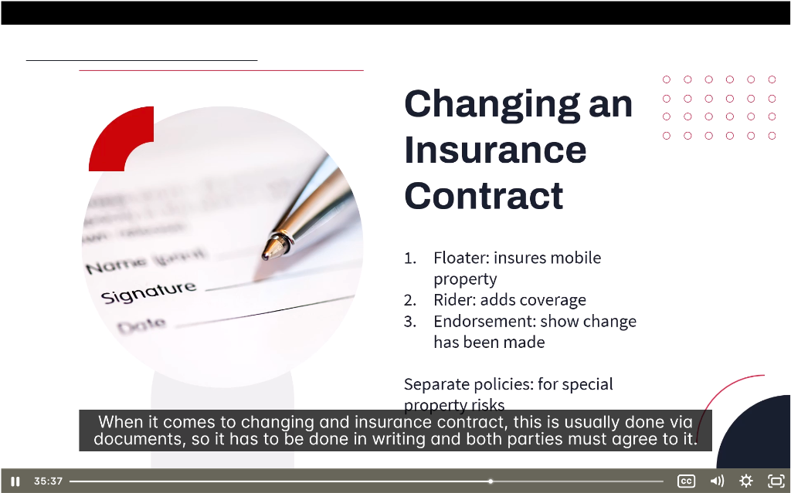
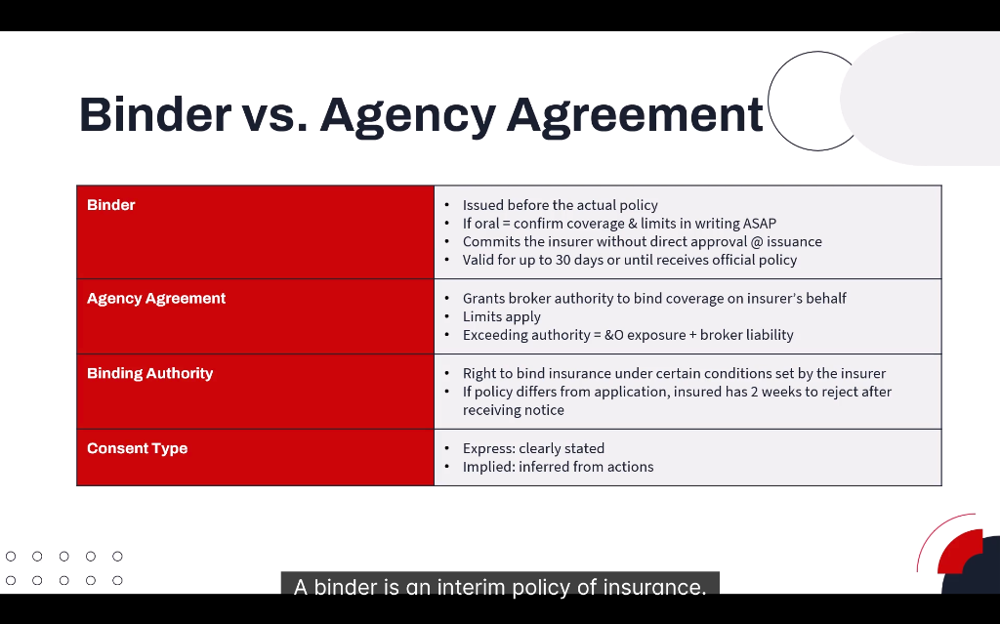
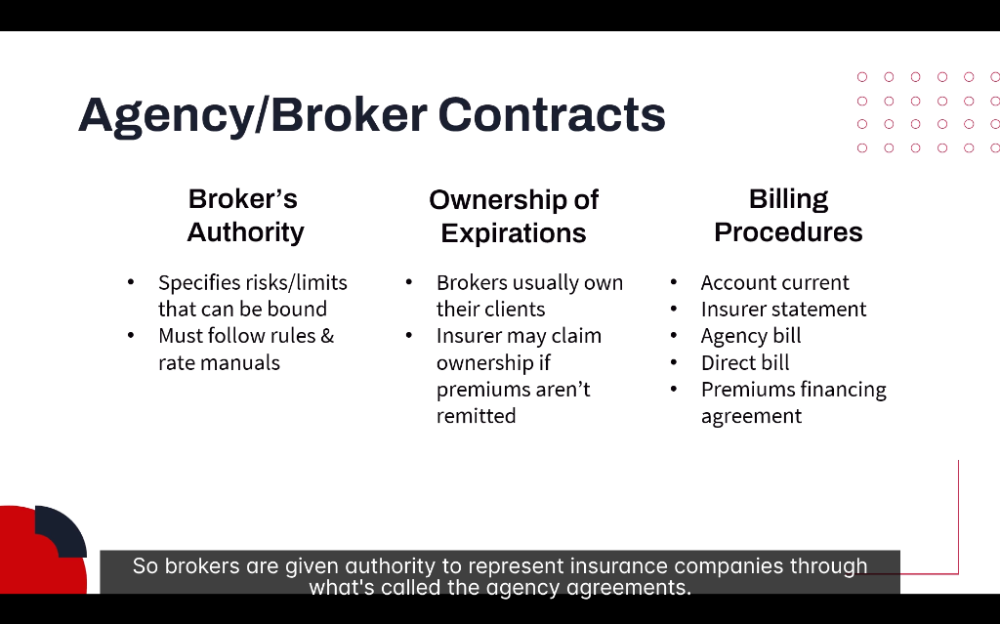

# 📝 Modifying Insurance Contracts & Broker Authority

> **Module:** Introduction | **Source:** PNC Learning - Demo RIBO 1 Sample Lecture

---

## 📸 Lecture Screenshots

---

## Overview

> **Key Concept:** When changing an insurance contract, it must be done in writing and both parties must agree.

This section covers:
- How to modify existing insurance contracts
- The role of binders in providing immediate coverage
- Agency agreements that grant brokers authority
- The broker's contractual relationship with insurers

---

## 1️⃣ Changing an Insurance Contract

Insurance contracts can be modified using several methods:

| Method | Purpose |
|--------|---------|
| **Floater** | Insures mobile property |
| **Rider** | Adds coverage |
| **Endorsement** | Shows a change has been made |
| **Separate Policy** | For special property risks |

---

### 📌 Floater

**Definition:** A type of coverage designed for **movable property** that travels with the insured.

| Feature | Description |
|---------|-------------|
| **Purpose** | Cover items that move from place to place |
| **Valuation** | Usually agreed value or replacement cost |
| **Location** | Coverage follows the item anywhere |

#### What Floaters Cover:

| Item Type | Example |
|-----------|---------|
| Jewelry | Engagement ring worth $10,000 |
| Fine arts | Paintings, sculptures |
| Musical instruments | Professional violin |
| Camera equipment | Photography gear |
| Sports equipment | Golf clubs, ski equipment |
| Business tools | Contractor's tools |

#### Real-Life Example:
> **Jewelry Floater:**
> 
> Sarah has a $15,000 engagement ring. Her homeowner's policy only covers jewelry up to $2,500.
> 
> **Solution:** Add a jewelry floater that:
> - Provides full $15,000 coverage
> - Covers loss anywhere (not just at home)
> - Has no deductible for scheduled items
> - Covers mysterious disappearance

---

### 📌 Rider

**Definition:** An addition to an existing policy that **adds new coverage** or modifies terms.

| Feature | Description |
|---------|-------------|
| **Purpose** | Add coverage not in base policy |
| **Attachment** | Becomes part of the original policy |
| **Premium** | Usually increases premium |

#### Common Riders:

| Insurance Type | Common Riders |
|----------------|---------------|
| **Home Insurance** | Sewer backup, earthquake, overland water |
| **Auto Insurance** | Rental car, roadside assistance |
| **Life Insurance** | Waiver of premium, accidental death |
| **Business Insurance** | Equipment breakdown, cyber liability |

#### Real-Life Example:
> **Sewer Backup Rider:**
> 
> Standard homeowner's policy EXCLUDES sewer backup damage.
> 
> Heavy rain causes sewage to back up into Tom's basement.
> 
> | Without Rider | With Rider |
> |---------------|------------|
> | ❌ Claim denied | ✅ Claim covered |
> | $25,000 out of pocket | Only pay deductible |

---

### 📌 Endorsement

**Definition:** A document that **amends** the original policy to show a change has been made. It **overrides** the original policy wording.

| Feature | Description |
|---------|-------------|
| **Purpose** | Record and implement changes |
| **Effect** | Overrides original wording |
| **Types** | Add, delete, or modify coverage |

#### Types of Endorsements:

| Type | What It Does | Example |
|------|--------------|---------|
| **Adding coverage** | Increases protection | Add earthquake coverage |
| **Removing exclusions** | Covers something previously excluded | Remove home business exclusion |
| **Changing limits** | Adjusts coverage amounts | Increase liability from $1M to $2M |
| **Changing deductibles** | Adjusts retention amount | Raise deductible from $500 to $1,000 |
| **Adding locations/items** | Expands what's covered | Add new vehicle to policy |

#### Real-Life Example:
> **Named Insured Endorsement:**
> 
> John gets married. His spouse needs to be added to the home insurance.
> 
> **Endorsement issued:**
> - Adds spouse as Named Insured
> - Policy now covers both parties
> - No need for new policy

> ⚠️ **Key Point:** Endorsements OVERRIDE original policy wording. Read them carefully!

---

### 📌 Separate Policies

**Definition:** For **special property risks** that require their own standalone policy.

| When Separate Policy Needed | Why |
|----------------------------|-----|
| High-value items | Exceed coverage limits |
| Unique risks | Not covered by standard policies |
| Commercial specialty | Unique business operations |
| Professional liability | E&O requires separate coverage |

#### Examples:

| Risk | Separate Policy Type |
|------|---------------------|
| Classic car collection | Collector vehicle policy |
| High-value art | Fine arts policy |
| Professional services | E&O / Professional liability |
| Directors & Officers | D&O liability policy |
| Cyber risks | Cyber liability policy |

---

## 2️⃣ Binders

**Definition:** A **binder** is an **interim policy of insurance** — temporary coverage issued before the actual policy.

### Key Features:

| Feature | Description |
|---------|-------------|
| **Timing** | Issued BEFORE the actual policy |
| **Duration** | Valid for up to **30 days** or until official policy received |
| **Commitment** | Commits the insurer without direct approval at issuance |
| **Format** | Can be oral, but must confirm in writing ASAP |

---

### When Binders Are Used:

| Situation | Why Binder Needed |
|-----------|-------------------|
| Closing on a house | Need coverage immediately |
| Buying a car | Can't drive without insurance |
| Starting a business | Need coverage from day one |
| Urgent renewal | Policy expiring, renewal not processed |

---

### Oral vs. Written Binders:

| Oral Binder | Written Binder |
|-------------|----------------|
| Given by phone | Formal document |
| Immediate effect | More documentation |
| **MUST confirm in writing ASAP** | Clear terms and conditions |
| Higher risk if disputed | Better protection for all parties |

> ⚠️ **Broker Responsibility:** If a binder is given orally, confirm coverage and limits **in writing as soon as possible!**

---

### Real-Life Example:
> **Home Purchase Binder:**
> 
> Client is closing on a house tomorrow at 2 PM.
> 
> **Process:**
> 1. Client calls broker at 10 AM
> 2. Broker issues oral binder for home insurance
> 3. Broker sends written confirmation by email
> 4. Coverage is in effect at closing
> 5. Formal policy issued within 30 days

---

## 3️⃣ Agency Agreement

**Definition:** A formal contract between a **broker/agency** and an **insurer** that grants authority to represent the insurer.

### What the Agency Agreement Covers:

| Component | Description |
|-----------|-------------|
| **Binding Authority** | What risks the broker can bind |
| **Commission** | How the broker gets paid |
| **Procedures** | Reporting, documentation, remittance |
| **Termination** | How either party can end the relationship |

---

### Binding Authority

**Definition:** The right to **bind insurance** (put coverage in force) under certain conditions set by the insurer.

| Aspect | Description |
|--------|-------------|
| **Limits** | Maximum amounts broker can bind |
| **Risk types** | What classes of business allowed |
| **Conditions** | Specific rules to follow |
| **Restrictions** | What broker CANNOT bind |

#### Binding Authority Limits Example:

| Risk Type | Broker Can Bind Up To |
|-----------|----------------------|
| Personal auto | $2 million liability |
| Homeowner's | $1 million dwelling |
| Small commercial | $500,000 property |
| Large commercial | Must refer to underwriter |

> ⚠️ **CRITICAL:** Exceeding binding authority = **E&O exposure + broker liability!**

If a broker binds coverage they're not authorized to, and a claim occurs:
- Insurer may deny coverage
- Broker becomes personally liable
- E&O claim likely

---

### 2-Week Rejection Rule

> **If policy differs from application, insured has 2 weeks to reject after receiving notice.**

This protects the insured when:
- Coverage differs from what was requested
- Premium is higher than quoted
- Terms/conditions are different

---

### Consent Types

| Type | Description |
|------|-------------|
| **Express Consent** | Clearly stated (written or verbal) |
| **Implied Consent** | Inferred from actions |

---

## 4️⃣ Agency/Broker Contracts

> **Brokers are given authority to represent insurance companies through agency agreements.**

### Three Key Components:

| Component | Description |
|-----------|-------------|
| **Broker's Authority** | What the broker can do |
| **Ownership of Expirations** | Who "owns" the customer |
| **Billing Procedures** | How money flows |

---

### 📌 Broker's Authority

The agency agreement specifies what the broker CAN and CANNOT do:

| Authority Granted | Broker Must Follow |
|-------------------|-------------------|
| Types of risks to bind | Insurer's rules |
| Coverage limits allowed | Rate manuals |
| Approved policy forms | Underwriting guidelines |

**Remember:** Broker authority is LIMITED. Always check your binding authority before committing coverage!

---

### 📌 Ownership of Expirations

**Definition:** Who "owns" the right to renew the client's business.

| Situation | Who Owns the Client |
|-----------|---------------------|
| **Typical arrangement** | Broker owns their clients |
| **Commission not remitted** | Insurer may claim ownership |
| **Broker leaves agency** | Depends on employment contract |

> 💡 **Ownership of expirations** is valuable! It means the broker keeps the client if they move to a different insurer.

#### Real-Life Example:
> A broker has 500 clients with Insurer A. They decide to move clients to Insurer B.
> 
> **If broker owns expirations:**
> - ✅ Can move clients to Insurer B
> - ✅ Keeps the book of business
> 
> **If insurer owns expirations:**
> - ❌ Clients may stay with Insurer A
> - ❌ New broker services them

---

### 📌 Billing Procedures

Different ways premiums are collected and remitted:

| Method | Description |
|--------|-------------|
| **Account Current** | Broker collects, remits monthly |
| **Insurer Statement** | Insurer tracks, broker remits |
| **Agency Bill** | Broker bills client, remits to insurer |
| **Direct Bill** | Insurer bills client directly |
| **Premium Financing** | Third party finances premium |

#### How Each Works:

| Method | Who Bills Client | Who Collects | Who Remits |
|--------|-----------------|--------------|------------|
| Agency Bill | Broker | Broker | Broker to insurer |
| Direct Bill | Insurer | Insurer | N/A (direct) |
| Premium Financing | Finance company | Finance company | Finance company |

---

## 📝 Quick Summary Table

| Topic | Key Points |
|-------|------------|
| **Floater** | Mobile property, follows the item |
| **Rider** | Adds coverage to existing policy |
| **Endorsement** | Amends policy, overrides wording |
| **Binder** | Temporary coverage (≤30 days) |
| **Agency Agreement** | Broker's contract with insurer |
| **Binding Authority** | What broker can bind; don't exceed it! |
| **Ownership of Expirations** | Broker usually owns clients |
| **Billing** | Agency bill vs. direct bill |

---

## 🧠 Practice Question

> A broker receives a call at 4:55 PM. A client needs home insurance immediately as they're closing on a house tomorrow morning. The broker issues oral confirmation of coverage. What should the broker do NEXT?
> 
> a) Wait for the client to send paperwork  
> b) Confirm the coverage and limits in writing as soon as possible  
> c) Tell the client to call back during business hours  
> d) Bind coverage that exceeds their binding authority to help the client

Click to reveal answer

**Answer: b) Confirm the coverage and limits in writing as soon as possible**

When an **oral binder** is issued, the broker MUST:
1. Confirm coverage in writing ASAP
2. Document the terms, limits, and effective date
3. Get the application completed quickly
4. Issue the formal policy within 30 days

**Why not the others:**
- a) Broker has the responsibility to document, not wait
- c) Coverage was already bound — can't undo it
- d) NEVER exceed binding authority — this creates E&O exposure and personal liability

---

## 🎓 Key RIBO Takeaways

1. **Floaters** cover mobile property (jewelry, art, equipment)
2. **Riders** add coverage; **Endorsements** modify/amend the policy
3. **Endorsements override** original policy wording
4. **Binders** = temporary coverage ≤30 days; confirm oral binders in writing!
5. **Binding authority** is LIMITED — never exceed it
6. **Exceeding authority = E&O exposure + personal liability**
7. **2-week rejection rule** if policy differs from application
8. **Ownership of expirations** — brokers usually own their clients

---

*← Back to: [Insurance Special Elements](./09-insurance-special-elements.md)*
