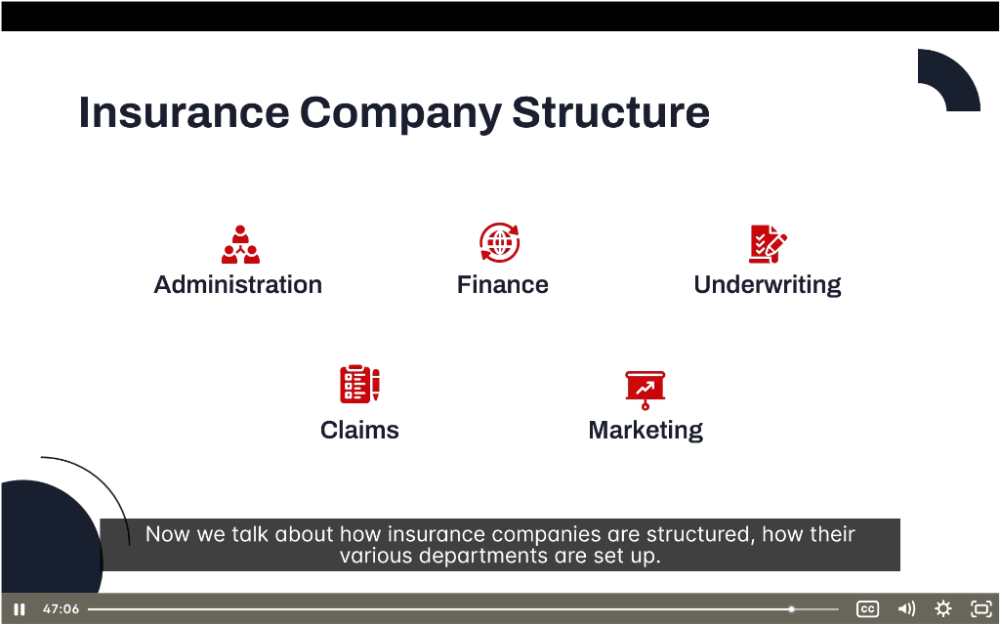

# 🏢 Insurance Company Structure

> **Module:** Introduction | **Source:** PNC Learning - Demo RIBO 1 Sample Lecture

---

## 📸 Lecture Screenshot



---

## Overview

Understanding how insurance companies are structured helps brokers know who to contact and how decisions are made.

> 💡 **Key Concept:** Insurance companies have 5 main departments that work together to deliver insurance products and services.

---

## 🗂️ The 5 Main Departments

| Department | Primary Function |
|------------|------------------|
| **Administration** | Overall management and operations |
| **Finance** | Money, investments, and financial reporting |
| **Underwriting** | Risk selection and pricing |
| **Claims** | Investigating and paying claims |
| **Marketing** | Sales, advertising, and broker relationships |

---

## 1️⃣ Administration

**Function:** Overall management and support for all other departments.

### What Administration Does:

| Task | Description |
|------|-------------|
| **Human Resources** | Hiring, training, benefits |
| **IT Systems** | Technology infrastructure |
| **Facilities** | Office space, equipment |
| **Legal** | Contracts, compliance, litigation |
| **Corporate Governance** | Board relations, policies |
| **Customer Service** | General inquiries, support |

### Who Works Here:

| Role | Responsibility |
|------|----------------|
| CEO | Overall company leadership |
| COO | Day-to-day operations |
| HR Manager | Employee relations |
| IT Director | Technology systems |
| Legal Counsel | Legal matters |

---

## 2️⃣ Finance

**Function:** Managing money — premiums, investments, and financial reporting.

### What Finance Does:

| Task | Description |
|------|-------------|
| **Premium collection** | Ensuring premiums are received |
| **Investments** | Managing the investment portfolio |
| **Reserves** | Setting aside funds for future claims |
| **Financial reporting** | Annual reports, regulatory filings |
| **Budgeting** | Planning and controlling costs |
| **Reinsurance** | Purchasing protection from reinsurers |

### Key Financial Concepts:

| Concept | Definition |
|---------|------------|
| **Premium Income** | Money collected from policyholders |
| **Investment Income** | Earnings from invested premiums |
| **Loss Reserves** | Money set aside for unpaid claims |
| **Surplus** | Assets minus liabilities (net worth) |

### Who Works Here:

| Role | Responsibility |
|------|----------------|
| CFO | Chief Financial Officer |
| Controller | Accounting oversight |
| Actuary | Risk calculations, pricing |
| Investment Manager | Portfolio management |
| Accountants | Day-to-day financial records |

> 💡 **For Brokers:** Finance handles commission payments and premium remittance issues!

---

## 3️⃣ Underwriting

**Function:** Selecting risks and setting prices — the "gatekeepers" of insurance.

### What Underwriting Does:

| Task | Description |
|------|-------------|
| **Evaluate applications** | Assess risk quality |
| **Accept/reject risks** | Decide who to insure |
| **Set premiums** | Price the risk appropriately |
| **Apply conditions** | Add exclusions, deductibles |
| **Issue policies** | Create the contract |
| **Set binding authority** | Define what brokers can bind |

### Key Underwriting Concepts:

| Concept | Definition |
|---------|------------|
| **Risk Selection** | Choosing which risks to accept |
| **Rate Making** | Setting premium prices |
| **Underwriting Guidelines** | Rules for accepting risks |
| **Appetite** | Types of risks the insurer wants |

### Who Works Here:

| Role | Responsibility |
|------|----------------|
| Chief Underwriter | Underwriting strategy |
| Senior Underwriter | Complex risks, high limits |
| Underwriter | Day-to-day risk evaluation |
| Underwriting Assistant | Support and data entry |

### Broker-Underwriter Relationship:

> ⚠️ **Underwriters are your key contacts!**

| What Brokers Need Underwriters For |
|------------------------------------|
| Approving risks outside binding authority |
| Getting quotes for complex risks |
| Negotiating terms and pricing |
| Clarifying coverage questions |
| Handling specialty accounts |

---

## 4️⃣ Claims

**Function:** Investigating, evaluating, and paying claims — the "moment of truth."

### What Claims Does:

| Task | Description |
|------|-------------|
| **Receive claims** | Initial notification and setup |
| **Investigate** | Determine what happened |
| **Evaluate** | Assess coverage and amount |
| **Negotiate** | Settle with claimants |
| **Pay claims** | Issue payments |
| **Detect fraud** | Identify suspicious claims |
| **Subrogate** | Recover from responsible third parties |

### The Claims Process:

| Step | What Happens |
|------|--------------|
| 1. **Notice** | Insured reports the loss |
| 2. **Assignment** | Claim assigned to adjuster |
| 3. **Investigation** | Gather facts, documents, evidence |
| 4. **Evaluation** | Determine coverage and value |
| 5. **Settlement** | Agree on payment amount |
| 6. **Payment** | Issue check or direct deposit |

### Who Works Here:

| Role | Responsibility |
|------|----------------|
| Claims Manager | Oversees claims operations |
| Claims Adjuster | Investigates and settles claims |
| Claims Examiner | Reviews smaller claims |
| Special Investigator | Fraud detection |
| Subrogation Specialist | Recovery from third parties |

### Broker's Role in Claims:

> Your client will judge you by how claims are handled!

| Broker Responsibility | Action |
|----------------------|--------|
| Report claims promptly | Notify insurer immediately |
| Assist client | Help gather documentation |
| Follow up | Check claim status regularly |
| Advocate | Help if disputes arise |

---

## 5️⃣ Marketing

**Function:** Selling insurance and managing distribution — including broker relationships!

### What Marketing Does:

| Task | Description |
|------|-------------|
| **Broker recruitment** | Finding and signing brokers |
| **Broker support** | Training, materials, visits |
| **Advertising** | Brand promotion |
| **Product development** | Creating new insurance products |
| **Market research** | Understanding customer needs |
| **Competitive analysis** | Monitoring competitors |

### Who Works Here:

| Role | Responsibility |
|------|----------------|
| VP Marketing | Marketing strategy |
| Business Development | Recruiting brokers |
| Underwriting Marketing Rep | Field support for brokers |
| Product Manager | New product development |
| Communications | Advertising, PR |

### Broker Relationship:

> **Marketing is where broker relationships are managed!**

| Marketing's Role with Brokers |
|------------------------------|
| Negotiate agency agreements |
| Set commission structures |
| Provide training and support |
| Handle broker complaints |
| Communicate new products |
| Manage contingent profit programs |

---

## How Departments Work Together

```
         ┌─────────────────┐
         │  ADMINISTRATION │
         │  (Management)   │
         └────────┬────────┘
                  │
    ┌─────────────┼─────────────┐
    │             │             │
    ▼             ▼             ▼
┌───────┐   ┌──────────┐   ┌─────────┐
│FINANCE│◄─►│UNDERWRITE│◄─►│ CLAIMS  │
└───┬───┘   └────┬─────┘   └────┬────┘
    │            │              │
    └────────────┼──────────────┘
                 │
         ┌───────▼───────┐
         │   MARKETING   │
         │  (Brokers!)   │
         └───────────────┘
```

| Interaction | Example |
|-------------|---------|
| Marketing ↔ Underwriting | "Can we offer this new product?" |
| Underwriting ↔ Claims | "We're seeing lots of claims from this type of risk" |
| Claims ↔ Finance | "We need reserves for this large claim" |
| Finance ↔ Administration | "Here's our quarterly report for the board" |
| Marketing ↔ Broker | "Here's your agency agreement and commission schedule" |

---

## 📝 Quick Summary Table

| Department | Key Function | Broker Contact For |
|------------|--------------|-------------------|
| **Administration** | Management | General issues, complaints |
| **Finance** | Money | Commission payments |
| **Underwriting** | Risk selection | Quotes, approvals, binding |
| **Claims** | Paying losses | Claim status, disputes |
| **Marketing** | Broker relations | Agency agreement, support |

---

## 🧠 Practice Question

> A broker has a client with a complex commercial risk that exceeds their binding authority. Which department should the broker contact FIRST?
> 
> a) Claims  
> b) Finance  
> c) Underwriting  
> d) Administration

<details>
<summary>Click to reveal answer</summary>

**Answer: c) Underwriting**

Underwriting is responsible for:
- Evaluating risks
- Approving risks outside binding authority
- Setting terms and pricing

The broker needs underwriting approval to bind this complex risk.

**Why not the others:**
- a) Claims handles losses after they occur, not new business
- b) Finance handles money, not risk selection
- d) Administration handles general management, not risk decisions

</details>

---

## 🎓 Key RIBO Takeaways

1. **5 main departments:** Administration, Finance, Underwriting, Claims, Marketing
2. **Underwriting** = Your key contact for quotes and approvals
3. **Claims** = Moment of truth; good claims service = client retention
4. **Marketing** = Manages broker relationships and agency agreements
5. **Finance** = Handles commission payments
6. **Know who to call** for each type of issue!

---

*← Back to: [Modifying Contracts & Broker Authority](./10-modifying-contracts-broker-authority.md)*
