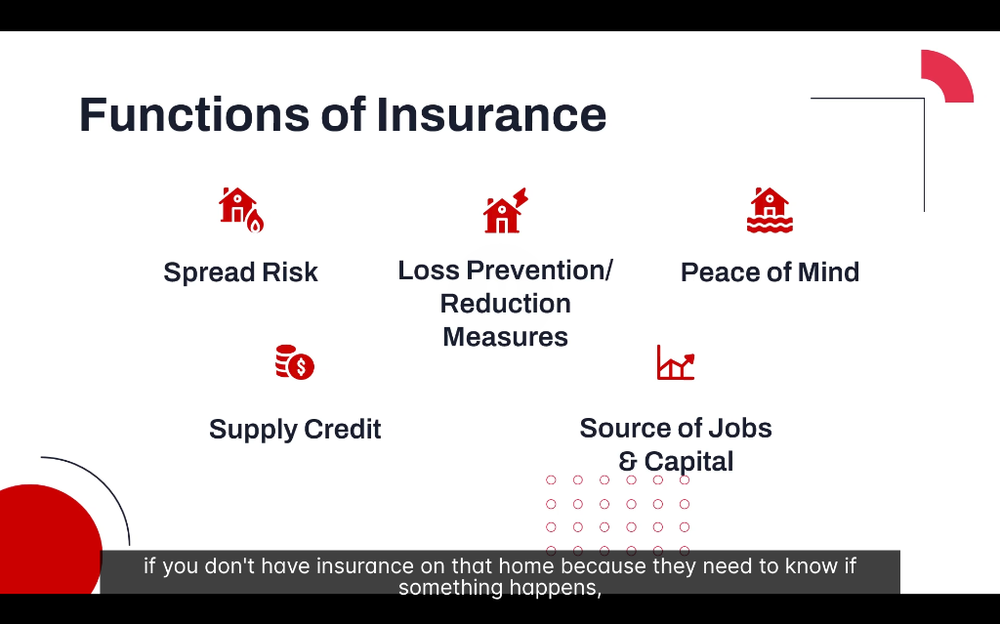
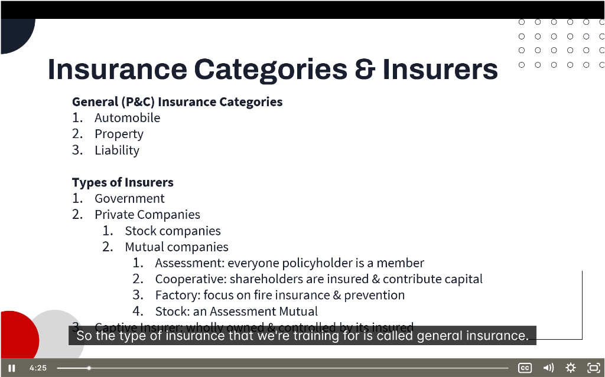

# 📘 Insurance Fundamentals

> **Chapter:** 01-Introduction to Insurance | **Source:** PNC Learning RIBO 1

---

## 📸 Lecture Screenshots

---

## 1️⃣ Definition of Insurance

Insurance is a contract where one party (insurer) agrees to compensate another (insured) for specified losses.

### The 5 Key Elements:

| # | Element | Explanation |
|---|---------|-------------|
| 1 | **Transfer Risk** | The insured transfers the risk of loss to the insurer |
| 2 | **Promise to Pay** | Insurer promises to pay if a covered loss occurs |
| 3 | **Accidental Losses** | Only covers unexpected, accidental events (not intentional) |
| 4 | **Principle of Indemnity** | Restores the insured to pre-loss position (no profit) |
| 5 | **Money or Repair/Replace** | Payment can be cash, repair, or replacement |

> 💡 **Key Concept:** Insurance is NOT a savings plan — it's risk transfer. You're paying someone else to take on your financial risk.

---

## 2️⃣ Functions of Insurance

Insurance serves 5 major functions in society:

| Function | Description |
|----------|-------------|
| **Spread Risk** | Pools premiums from many to pay losses of few |
| **Loss Prevention/Reduction** | Insurers promote safety (discounts for alarms, sprinklers) |
| **Peace of Mind** | Knowing you're protected reduces worry |
| **Supply Credit** | Banks require insurance before lending (mortgages, car loans) |
| **Source of Jobs & Capital** | Insurance industry employs thousands, invests billions |

### Why Each Matters:

#### Spread Risk
> One person can't afford a $500,000 house fire. But 100,000 people each paying $500/year creates a $50M pool to cover the few who have fires.

#### Supply Credit
> Banks won't give you a mortgage without home insurance — if the house burns down, they need to know their loan is protected!

#### Source of Jobs & Capital (2026 Context)
> Insurance companies invest premiums in bonds, stocks, and real estate. In Ontario alone, the P&C industry employs over 125,000 people.

---

## 3️⃣ General Insurance (P&C) Categories

RIBO covers **General Insurance**, also called **Property & Casualty (P&C)**:

| # | Category | Examples |
|---|----------|----------|
| 1 | **Automobile** | Personal auto, commercial auto, fleet |
| 2 | **Property** | Home, business, fire, theft, flood |
| 3 | **Liability** | CGL, professional liability, D&O |

> ❌ **NOT Covered by RIBO:** Life Insurance (requires LLQP license)

---

## 4️⃣ Types of Insurers

### Overview Table:

| Type | Ownership | Key Feature |
|------|-----------|-------------|
| **Government** | Public/taxpayer | Mandatory programs (OHIP, WSIB) |
| **Stock Company** | Shareholders | For-profit, traded on exchanges |
| **Mutual Company** | Policyholders | Non-profit, dividends to members |
| **Reciprocal Exchange** | Subscribers | Members insure each other |
| **Captive Insurer** | Parent company | Self-insurance for large corps |

---

### 📌 Government Insurers

| Program | What It Covers |
|---------|----------------|
| **OHIP** | Ontario health insurance (hospital, doctors) |
| **WSIB** | Workers' compensation (workplace injuries) |
| **CMHC** | Mortgage default insurance |

> 💡 These are funded by taxes or employer premiums, NOT voluntary purchase.

---

### 📌 Stock Insurance Companies

**Definition:** Owned by **shareholders** who invest for profit.

| Feature | Description |
|---------|-------------|
| **Ownership** | Shareholders (not policyholders) |
| **Goal** | Maximize profit for shareholders |
| **Governance** | Board of directors, traded on stock exchange |
| **Examples** | Intact, Aviva, Travelers |

> 💡 If you buy shares of Intact on the TSX, you own part of that insurer!

---

### 📌 Mutual Insurance Companies

**Definition:** Owned by **policyholders** — the people who buy the insurance.

| Feature | Description |
|---------|-------------|
| **Ownership** | Policyholders are members |
| **Goal** | Benefit members, not profit |
| **Surplus** | Returned as dividends or lower premiums |
| **Examples** | Gore Mutual, Wawanesa, Cayuga Mutual |

#### Types of Mutuals:

| Type | Description |
|------|-------------|
| **Assessment Mutual** | Members pay assessments if claims exceed premiums |
| **Cooperative** | Shareholders are insured & contribute capital |
| **Factory Mutual** | Focuses on fire insurance & prevention (industrial) |
| **Stock Mutual** | Hybrid — operates like stock company but member-owned |

> 💡 Ontario has 40+ independent mutual insurers, some over 160 years old!

---

### 📌 Reciprocal Insurance Exchange

**Definition:** A **non-profit** structure where subscribers agree to **insure each other**.

| Feature | Description |
|---------|-------------|
| **Ownership** | Subscribers (members) |
| **Structure** | Managed by an "Attorney-in-Fact" |
| **Surplus** | Returned to members |
| **Example** | Ontario School Boards' Insurance Exchange |

> 💡 As of 2026, Ontario School Boards' Insurance Exchange is designated as a **public sector reciprocal**.

---

### 📌 Captive Insurance Company

**Definition:** A licensed insurer created by a **parent company to insure its own risks**.

| Feature | Description |
|---------|-------------|
| **Ownership** | Wholly owned by parent organization |
| **Purpose** | Self-insure hard-to-place or expensive risks |
| **Benefits** | Control over coverage, potential investment income |
| **Users** | Large corporations, non-profits, associations |

> 💡 Example: A large construction company creates its own captive to insure high-risk projects.

---

## 📝 Quick Summary

| Topic | Key Takeaway |
|-------|--------------|
| **Definition** | Risk transfer + promise to pay for accidental losses |
| **Indemnity** | Restore to pre-loss, no profit |
| **Functions** | Spread risk, prevent loss, credit, peace of mind, jobs |
| **P&C Categories** | Auto, Property, Liability |
| **Stock vs Mutual** | Shareholder-owned vs policyholder-owned |
| **Reciprocal** | Members insure each other |
| **Captive** | Parent company insures itself |

---

## 🧠 Practice Question

> Which type of insurer returns surplus profits to its policyholders as dividends or reduced premiums?
> 
> a) Stock insurance company  
> b) Mutual insurance company  
> c) Captive insurer  
> d) Government insurer

Click to reveal answer

**Answer: b) Mutual insurance company**

Mutual insurers are **owned by policyholders**. Any surplus (profit) is returned to them through:
- Dividend payments
- Reduced premiums
- Improved coverage

**Why not the others:**
- a) Stock companies return profits to shareholders, not policyholders
- c) Captives benefit the parent company, not individual insureds
- d) Government insurers are taxpayer-funded, not profit-sharing

---

*← Back to: [Chapter 1 README](./README.md)*
