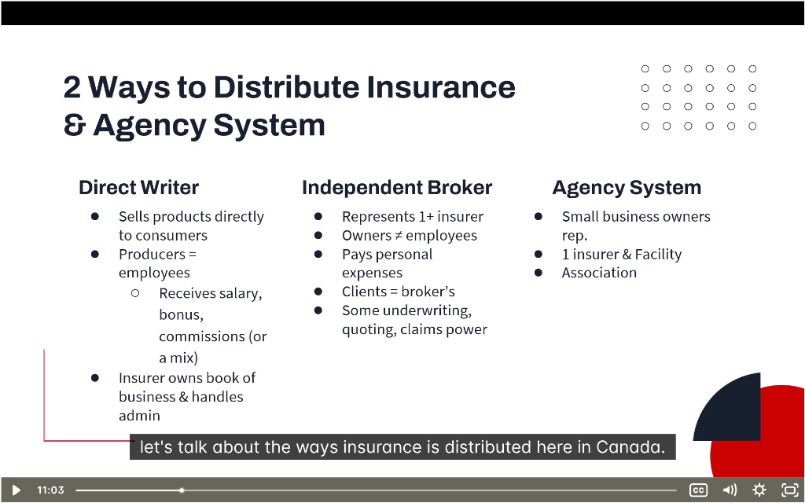

# 🔄 Insurance Distribution Channels

> **Chapter:** 01-Introduction to Insurance | **Source:** PNC Learning RIBO 1 + Study Guide

---

## 📸 Lecture Screenshot

---

## Overview

Insurance gets from insurers to consumers through **distribution channels**. There are 2 main ways:

| Method | Who Sells |
|--------|-----------|
| **Direct Writer** | Insurer's own employees sell directly to consumers |
| **Independent Broker** | Independent businesses sell from multiple insurers |

Plus two important variations:
- **Agency System** (exclusive agents for 1 insurer)
- **MGA** (wholesalers between insurers and brokers)

---

## 1️⃣ Direct Writer (D2C = Direct to Consumer)

**Definition:** The **insurer** sells its own products **directly** to consumers using its own **employees**.

| Feature | Description |
|---------|-------------|
| **Who sells** | Employees of the insurer (called "Producers") |
| **Products** | Only that insurer's products |
| **Compensation** | Salary, bonus, commissions, or a mix |
| **Who owns the clients** | The **insurer** owns the book of business |
| **Admin** | Insurer handles all administration |

### Pros and Cons:

| Pros | Cons |
|------|------|
| Streamlined experience | Limited product selection |
| One company, one contact | Can't shop around for best price |
| May have lower overhead costs | No independent advice |

> 💡 **Example:** Belairdirect, Sonnet — you buy online directly from them, no broker involved.

---

## 2️⃣ Independent Broker (What YOU'RE Training For!)

**Definition:** A **licensed professional** who represents **more than 1 insurer** and earns commission on sales.

| Feature | Description |
|---------|-------------|
| **Who sells** | Licensed brokers (NOT employees of insurer) |
| **Products** | Multiple insurers' products |
| **Compensation** | Commission from insurers |
| **Expenses** | Broker pays their own expenses |
| **Who owns the clients** | The **BROKER** owns the clients! |
| **Powers** | May have some underwriting, quoting, claims authority |

### Why Clients Love Brokers:

| Benefit | How It Helps Client |
|---------|---------------------|
| **Choice** | Shop multiple insurers for best price/coverage |
| **Advice** | Independent — not biased toward one insurer |
| **Advocacy** | Broker fights for YOU in claims |
| **Expertise** | Can find specialized coverage |

> 💡 **Key Difference:** Clients belong to the BROKER, not the insurer. If you move to a new brokerage, your clients can come with you!

### 2026 Context: Broker Challenges

| Challenge | What's Happening |
|-----------|------------------|
| **Direct writers expanding** | Competing for small business market |
| **Digital-first expectations** | Clients want online quotes, apps |
| **Auto insurance reforms** | July 2026 changes require educating clients |

---

## 3️⃣ Agency System (Exclusive Agents)

**Definition:** **Small business owners** (agents) who represent **only 1 insurer** + the Facility Association.

| Feature | Description |
|---------|-------------|
| **Who sells** | Independent agent (small business owner) |
| **Products** | Only **1 insurer's** products + Facility Association |
| **Compensation** | Commissions |
| **Who owns the clients** | Agent owns their **book of business** |
| **Examples** | State Farm, Co-operators |

### Agency vs Broker:

| Feature | Agency (Agent) | Broker |
|---------|----------------|--------|
| **# of Insurers** | 1 only | 2 or more |
| **Independence** | Tied to one company | Fully independent |
| **Product range** | Limited | Wide selection |

### What's Facility Association?

> The **Facility Association** provides auto insurance to people who can't get it in the regular market (high-risk drivers).

| Why Someone Uses Facility | Example |
|---------------------------|---------|
| Multiple accidents | 3 at-fault accidents in 2 years |
| DUI conviction | Impaired driving on record |
| New driver, no history | No insurance experience |
| Policy cancelled | Non-payment, fraud |

> 💡 **Agents represent Facility Association** so they can still help high-risk clients get coverage (at higher premiums).

---

## 4️⃣ Managing General Agent (MGA)

**Definition:** MGAs are **"wholesalers"** — intermediaries between **insurers** and **brokers**.

> Think of MGAs as the "middlemen" who specialize in certain products and help insurers distribute them.

### What MGAs Do:

| MGA Power | Description |
|-----------|-------------|
| **Underwriting** | Evaluate and accept risks on behalf of insurers |
| **Settle claims** | Handle claims processing |
| **Appoint brokerages** | Authorize brokerages to sell their products |
| **Specialized expertise** | Focus on niche products |

### Common MGA Specialties:

| Specialty | Products |
|-----------|----------|
| **E&O / Professional Liability** | Errors & Omissions for professionals |
| **Commercial Transportation** | Trucking, fleet vehicles |
| **Hard-to-place risks** | Clients declined by regular insurers |
| **Cyber Liability** | Data breach, ransomware coverage |
| **Contractors/Builders** | Construction risks |

### 2026 Context: MGAs in Ontario

| Stat | Data |
|------|------|
| **# of MGAs in Ontario** | ~139 (as of Dec 2024) |
| **RIBO-licensed** | Over 50% are voluntarily RIBO-licensed |
| **Why volunteer?** | Consumer protection, credibility |

> 💡 RIBO has voluntarily licensed P&C MGAs for over 20 years to ensure strong consumer protection.

---

### MGA Structure Options:

MGAs can be structured in two ways:

#### A. Independent Brokerage (MGA as Broker)

| Feature | Description |
|---------|-------------|
| **Insurers** | Sells from **2+ insurance companies** |
| **Commission** | Receives commissions from insurers |
| **Staff** | Every working member **must be licensed** |
| **Business model** | Independent business |

#### B. Independent Agency (MGA as Agent)

| Feature | Description |
|---------|-------------|
| **Insurers** | Sells from **1 company only** |
| **Ownership** | Owned by 1 or more individual agents |
| **Commission** | Earns commissions from partnered insurer |
| **Portfolio** | Owns its book of business |

### Can MGAs Sell Directly to Clients?

> ✅ **Yes!** MGAs can deal directly with clients **if staff have appropriate licenses**.

---

## 📊 Distribution Channel Comparison

| Feature | Direct Writer | Ind. Broker | Agency | MGA |
|---------|--------------|-------------|--------|-----|
| **Products** | 1 insurer | Multiple | 1 insurer | Varies |
| **Employees of insurer?** | Yes | No | No | No |
| **Who owns clients** | Insurer | Broker | Agent | Varies |
| **Pays own expenses** | No | Yes | Yes | Yes |
| **Underwriting power** | No | Sometimes | No | Yes |
| **Claims power** | No | Sometimes | No | Yes |
| **Examples** | Belairdirect | Any RIBO brokerage | State Farm | Apollo Cover |

---

## 🧠 Practice Questions

### Question 1:
> A client wants to compare prices from 5 different insurers. Which distribution channel should they use?
> 
> a) Direct Writer  
> b) Independent Broker  
> c) Agency System  
> d) MGA

Click to reveal answer

**Answer: b) Independent Broker**

Independent brokers represent **multiple insurers** and can shop around for the best price and coverage. 

A direct writer or agent only sells 1 insurer's products, so they can't compare.

---

### Question 2:
> An agent represents only Co-operators and the Facility Association. What distribution system is this?
> 
> a) Direct Writer  
> b) Independent Broker  
> c) Agency System  
> d) MGA

Click to reveal answer

**Answer: c) Agency System**

Agency System agents are small business owners who represent **1 insurer only** plus the Facility Association.

State Farm and Co-operators are classic examples of the agency system.

---

### Question 3:
> What is a Managing General Agent (MGA)?
> 
> a) An employee of an insurance company  
> b) A wholesaler between insurers and brokers  
> c) A government regulator  
> d) A claims adjuster

Click to reveal answer

**Answer: b) A wholesaler between insurers and brokers**

MGAs are intermediaries (wholesalers) that:
- Have underwriting powers
- Settle claims
- Appoint brokerages to sell products
- Specialize in niche products (E&O, cyber, etc.)

---

## 🎓 Key RIBO Takeaways

1. **2 main distribution methods:** Direct Writer vs Independent Broker
2. **Direct writers** = employees of insurer, sell only that insurer's products
3. **Independent brokers** = represent multiple insurers, OWN their clients
4. **Agency System** = 1 insurer only + Facility Association (e.g., State Farm)
5. **MGA** = wholesalers with underwriting, claims, and appointing powers
6. **50%+ of Ontario MGAs** are voluntarily RIBO-licensed
7. **July 2026:** Brokers must educate clients on new auto insurance optionality

---

*← Back to: [Chapter 1 README](./README.md)*
